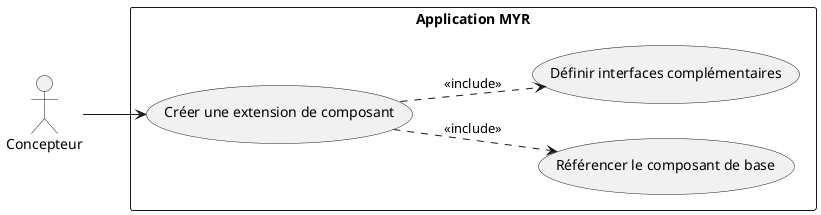
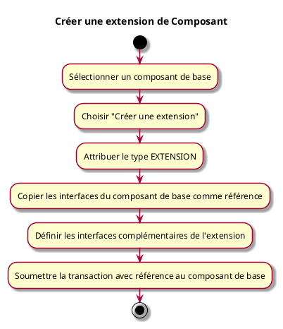

---
categorie: Composant Ecriture
titre: "Créer une extension de Composant"
probabilite: 2
impact: 5
importance: 10
etat: relire
---

# Créer une extension de Composant

## Diagramme d'acteurs

## Contexte

Création d'une pièce complémentaire à un composant existant. Il s'agit d'une EXTENSION dans la taxonomie MYR.

## Pré-conditions

- Être connecté au réseau
- Avoir les droits de création
- Composant de base existant sur le réseau

## Scénario

**Étape initiale :** L'utilisateur sélectionne un composant de base et choisit "Créer une extension"

### Flux nominal — Extension créée

1. Le type EXTENSION est attribué
2. Les interfaces du composant de base sont copiées comme référence
3. L'utilisateur définit les interfaces complémentaires de l'extension
4. La transaction est soumise avec référence au composant de base

## Post-conditions

- L'extension est enregistrée et liée au composant de base
- Les interfaces de compatibilité sont documentées

## Diagramme d'activités

