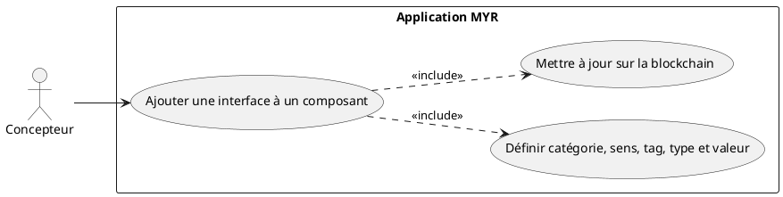
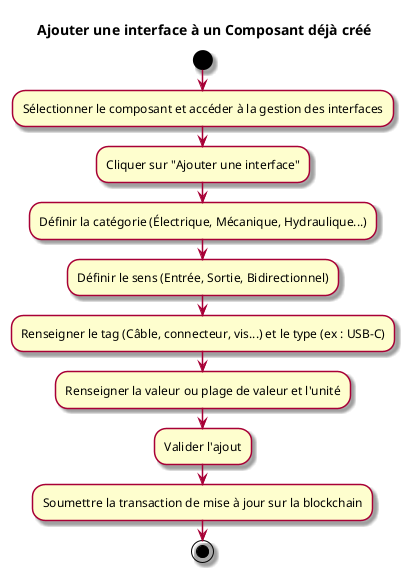

---
categorie: Composant Ecriture
titre: "Ajouter une interface à un Composant déjà créé"
probabilite: 2
impact: 3
importance: 6
etat: relire
---

# Ajouter une interface à un Composant déjà créé

## Diagramme d'acteurs

## Contexte

Un utilisateur peut ajouter manuellement une interface à un composant qu'il a déjà créé, utile lorsque la détection automatique n'a pas pu être réalisée.

## Pré-conditions

- Être connecté au réseau
- Être propriétaire du composant
- Avoir les droits d'édition

## Scénario

**Étape initiale :** L'utilisateur sélectionne son composant et accède à la gestion des interfaces

### Flux nominal — Interface ajoutée

1. L'utilisateur clique sur "Ajouter une interface"
2. Il définit la catégorie (Électrique, Mécanique, Hydraulique...)
3. Il définit le sens (Entrée, Sortie, Bidirectionnel)
4. Il renseigne le tag (Câble, connecteur, vis...) et le type (ex : USB-C)
5. Il renseigne la valeur ou plage de valeur et l'unité (Volt, mm...)
6. Il valide l'ajout
7. La transaction de mise à jour est soumise sur la blockchain

## Post-conditions

- L'interface est ajoutée au composant sur le réseau
- Elle est disponible pour les liaisons dans l'atelier

## Diagramme d'activités

