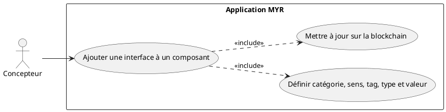
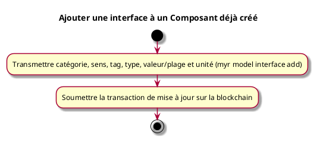

---
categorie: Composant Ecriture
titre: "Ajouter une interface à un Composant déjà créé"
probabilite: 2
impact: 3
importance: 6
etat: relire
---

# Ajouter une interface à un Composant déjà créé

## Diagramme d'acteurs

## Contexte

Un utilisateur peut ajouter manuellement une interface à un composant qu'il a déjà créé, utile lorsque la détection automatique n'a pas pu être réalisée.

## Pré-conditions

- Être connecté au réseau
- Être propriétaire du composant
- Avoir les droits d'édition

## Scénario

**Étape initiale :** `myr model interface add <assetID> --category MECA --type "vis M6" --direction bidir --value-min 5 --value-max 6 --unit mm` est exécutée (ou l'appel API équivalent), pour le compte du propriétaire du composant

### Flux nominal — Interface ajoutée

1. La catégorie (Électrique, Mécanique, Hydraulique...) est définie
2. Le sens (Entrée, Sortie, Bidirectionnel) est défini
3. Le tag (Câble, connecteur, vis...) et le type (ex : USB-C) sont renseignés
4. La valeur ou plage de valeur et l'unité (Volt, mm...) sont renseignées
5. La transaction de mise à jour est soumise sur la blockchain
6. L'interface devient disponible pour les liaisons (voir UCAM01)

## Post-conditions

- L'interface est ajoutée au composant sur le réseau
- Elle est disponible pour les liaisons (voir UCAM01)

## Diagramme d'activités

