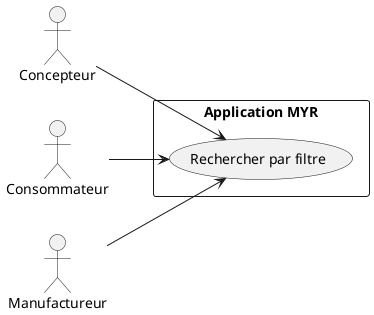
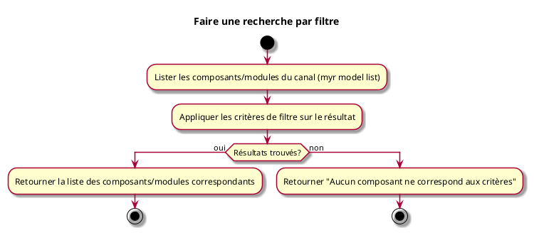

---
categorie: Composant Lecture
titre: "Faire une recherche par filtre"
probabilite: 4
impact: 4
importance: 16
etat: relire
---

# Faire une recherche par filtre

## Diagramme d'acteurs

## Contexte

La recherche par filtre permet de trouver des composants ou Modules selon des critères précis (type, catégorie, interface, licence, auteur...).

## Pré-conditions

- Être connecté au réseau
- La parité de filtrage entre le résultat brut de la liste et un filtrage serveur dédié reste partielle, voir flux nominal

## Scénario

**Étape initiale :** `myr model list [--channel <id>]` est exécutée (ou l'appel API équivalent) pour obtenir la liste des composants et modules du canal

### Flux nominal — Résultats trouvés

1. Un ou plusieurs critères de filtre (texte, catégorie, auteur, tags…) sont appliqués sur le résultat de la liste
2. La liste des composants/modules correspondants est retournée
3. `myr model get <id>` permet de consulter un composant/module précis une fois son identifiant connu

### Flux nominal — Aucun résultat

1. La réponse indique qu'aucun composant ne correspond aux critères

## Post-conditions

- La liste des composants/modules correspondant aux critères est affichée

## Diagramme d'activités

