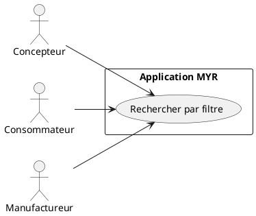
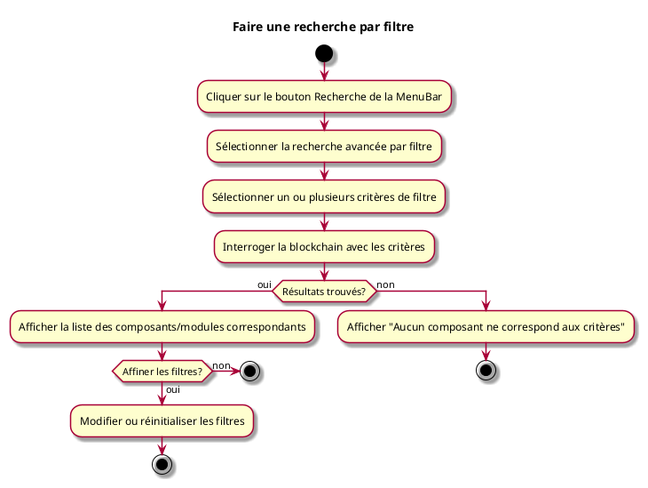

---
categorie: Composant Lecture
titre: "Faire une recherche par filtre"
probabilite: 4
impact: 4
importance: 16
etat: relire
---

# Faire une recherche par filtre

## Diagramme d'acteurs

## Contexte

La recherche par filtre permet de trouver des composants ou Modules selon des critères précis (type, catégorie, interface, licence, auteur...).

## Pré-conditions

- Être connecté au réseau

## Scénario

**Étape initiale :** L'utilisateur clique sur le bouton **Recherche** de la MenuBar, puis sélectionne la recherche avancée par filtre dans la Search UI

### Flux nominal — Résultats trouvés

1. L'utilisateur sélectionne un ou plusieurs critères de filtre
2. Le système interroge la blockchain avec les critères
3. La liste des composants/modules correspondants est affichée
4. L'utilisateur peut affiner ou réinitialiser les filtres

### Flux nominal — Aucun résultat

1. Un message indique qu'aucun composant ne correspond aux critères

## Post-conditions

- La liste des composants/modules correspondant aux critères est affichée

## Diagramme d'activités

