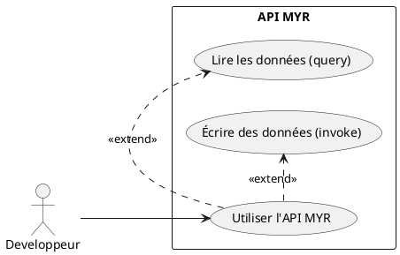
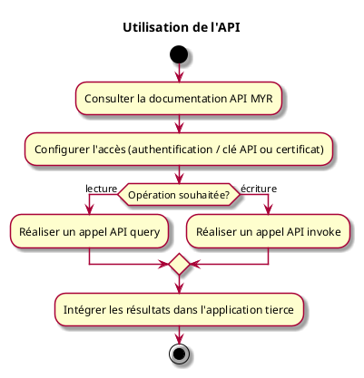

---
categorie: Développement autour de MYR
titre: "Utilisation de l'API"
probabilite: 1
importance: 0
---

# Utilisation de l'API

## Diagramme d'acteurs

## Contexte

Les développeurs peuvent utiliser l'API REST MYR pour intégrer ses fonctionnalités dans leurs applications tierces (boutiques, éditeurs 3D, plugins CAO...).

## Pré-conditions

- Avoir les droits d'accès à l'API (rôle Développeur)
- Clé API ou certificat disponible

## Scénario

**Étape initiale :** Le développeur consulte la documentation API MYR

### Flux nominal — Intégration réussie

1. Le développeur configure l'accès (authentification)
2. Il réalise des appels API (query pour lecture, invoke pour écriture)
3. Il intègre les résultats dans son application tierce

## Post-conditions

- L'application tierce est intégrée avec le réseau MYR

## Diagramme d'activités

