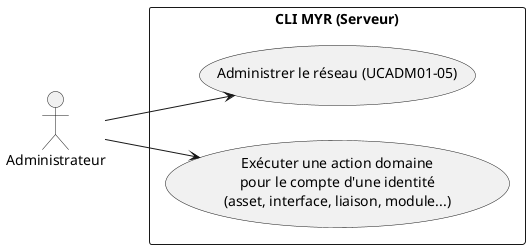
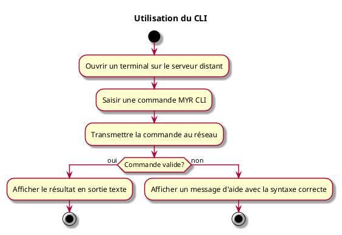

---
categorie: Développement autour de MYR
titre: "Utilisation du CLI"
probabilite: 1
importance: 0
etat: relire
---

# Utilisation du CLI

## Diagramme d'acteurs

## Contexte

Le CLI `myr` n'est pas un outil d'administration réseau au sens strict : il expose la **totalité** des capacités du domaine (`domain/`), au même titre que l'API REST — le CLI n'est pas un citoyen de seconde zone par rapport à l'API. Toute action métier exposée par l'API (créer un composant, définir une interface, créer une liaison, assembler et soumettre un module, rechercher un asset…) a donc une commande `myr` équivalente, en plus des commandes propres à l'administration réseau (`myr network/org/node`, UCADM01–05).

Ce qui distingue le CLI de l'API REST n'est pas le périmètre fonctionnel mais **qui peut l'exécuter et où** : conformément au principe d'exécution distante, `myr` (CLI et serveur d'API) ne tourne jamais sur le poste d'un utilisateur final — uniquement sur le serveur, via une connexion SSH de l'administrateur. Un Concepteur ou un Consommateur n'ouvre donc jamais lui-même un terminal `myr` ; c'est l'administrateur du serveur qui, le cas échéant, exécute une commande domaine **pour le compte** d'une identité (scripts d'import en masse, migration, support, restauration après incident).

Le Développeur (UCDEV01), qui n'a pas d'accès SSH au serveur, interagit avec MYR exclusivement via l'API REST — un client tiers (interface graphique, boutique partenaire, plugin CAO...) fait de même. Ce n'est pas une limitation fonctionnelle du CLI, mais une conséquence du modèle d'exécution distante.

## Pré-conditions

- Être connecté sur le serveur distant (SSH)

## Scénario

**Étape initiale :** L'administrateur ouvre un terminal sur le serveur distant

### Flux nominal — Commande d'administration réseau

1. L'administrateur saisit une commande d'administration (ex : `myr network add`, `myr org add`, `myr node add` — voir UCADM01–05)
2. La commande est transmise au réseau
3. Le résultat est affiché en sortie texte dans le terminal

### Flux nominal — Commande domaine (parité API/CLI)

1. L'administrateur saisit une commande domaine pour le compte d'une identité (ex : `myr model add`, `myr model interface add`, `myr model link add`, `myr module submit` — voir les use cases UCCE/UCAM/UCMOD correspondants)
2. La commande appelle le même service domaine que le handler REST équivalent — les mêmes règles métier s'appliquent (anti-plagiat, compatibilité de licence, compatibilité d'interfaces…)
3. Le résultat est affiché en sortie texte dans le terminal

### Flux erreur — Commande invalide

1. Un message d'aide est affiché avec la syntaxe correcte

### Flux erreur — Règle métier violée

1. Le service domaine rejette l'action (ex : hash déjà existant, interface déjà utilisée, licence incompatible)
2. Le message d'erreur retourné par le service est affiché tel quel — identique à celui que recevrait un client REST

## Post-conditions

- La commande CLI a été exécutée avec succès, avec le même effet et les mêmes règles métier que l'action équivalente via l'API REST

## Diagramme d'activités

