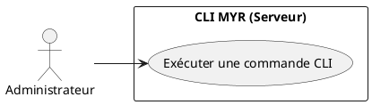
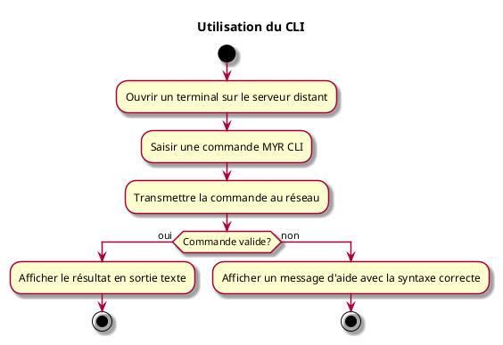

---
categorie: Développement autour de MYR
titre: "Utilisation du CLI"
probabilite: 1
importance: 0
etat: relire
---

# Utilisation du CLI

## Diagramme d'acteurs

## Contexte

L'administrateur peut utiliser le CLI MYR directement sur le serveur pour administrer le réseau. Le Développeur n'a pas accès au CLI — il interagit avec MYR exclusivement via l'API REST.

## Pré-conditions

- Être connecté sur le serveur distant

## Scénario

**Étape initiale :** L'administrateur ouvre un terminal

### Flux nominal — Commande exécutée

1. L'utilisateur saisit une commande MYR CLI (ex : myr query asset --id UUID)
2. La commande est transmise au réseau
3. Le résultat est affiché en sortie texte dans le terminal

### Flux erreur — Commande invalide

1. Un message d'aide est affiché avec la syntaxe correcte

## Post-conditions

- La commande CLI a été exécutée avec succès

## Diagramme d'activités

