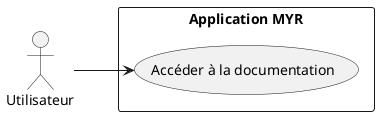
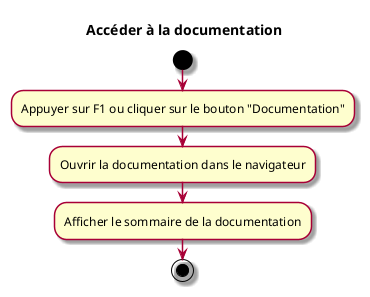

---
categorie: Documentation
titre: "Accéder à la documentation"
probabilite: 3
impact: 2
importance: 6
---

# Accéder à la documentation

## Diagramme d'acteurs

## Contexte

La documentation doit se trouver sur l'interface ou être accessible via la touche F1.

## Pré-conditions

- Application MYR ouverte

## Scénario

**Étape initiale :** L'utilisateur appuie sur F1 ou clique sur le bouton "Documentation"

### Flux nominal — Documentation ouverte

1. La documentation s'ouvre dans le navigateur
2. Le sommaire de la documentation est affiché

## Post-conditions

- La documentation est accessible à l'utilisateur

## Diagramme d'activités

