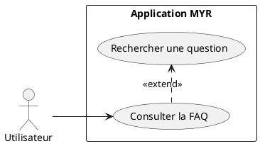
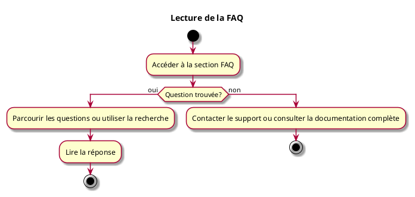

---
categorie: Documentation
titre: "Lecture de la FAQ"
probabilite: 3
impact: 1
importance: 3
etat: relire
---

# Lecture de la FAQ

## Diagramme d'acteurs

## Contexte

La FAQ doit répondre aux questions types récurrentes demandées par les utilisateurs.

## Pré-conditions

- Avoir accès à la documentation

## Scénario

**Étape initiale :** L'utilisateur accède à la section FAQ

### Flux nominal — Réponse trouvée

1. L'utilisateur parcourt les questions ou utilise la recherche
2. La réponse à sa question est trouvée

### Flux nominal — Réponse non trouvée

1. L'utilisateur est invité à contacter le support ou à consulter la documentation complète

## Post-conditions

- L'utilisateur a obtenu une réponse à sa question

## Diagramme d'activités

