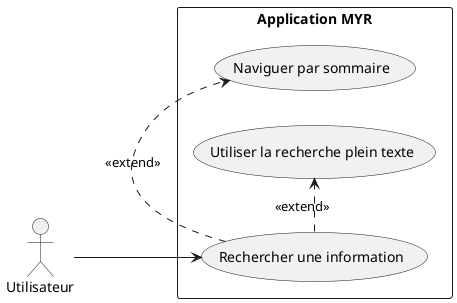
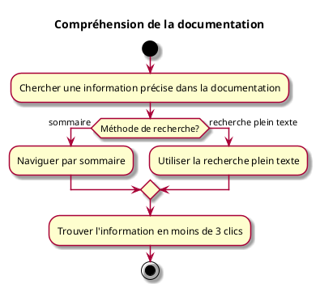

---
categorie: Documentation
titre: "Compréhension de la documentation"
probabilite: 1
impact: 1
importance: 1
etat: relire
---

# Compréhension de la documentation

## Diagramme d'acteurs

## Contexte

La documentation doit être claire et les informations recherchées facilement trouvables pour tous les profils d'utilisateurs.

## Pré-conditions

- Avoir accès à la documentation

## Scénario

**Étape initiale :** L'utilisateur cherche une information précise dans la documentation

### Flux nominal — Information trouvée rapidement

1. L'utilisateur utilise la recherche plein texte ou le sommaire
2. L'information est trouvée en moins de 3 clics

## Post-conditions

- L'information recherchée est trouvée facilement et comprise

## Diagramme d'activités

