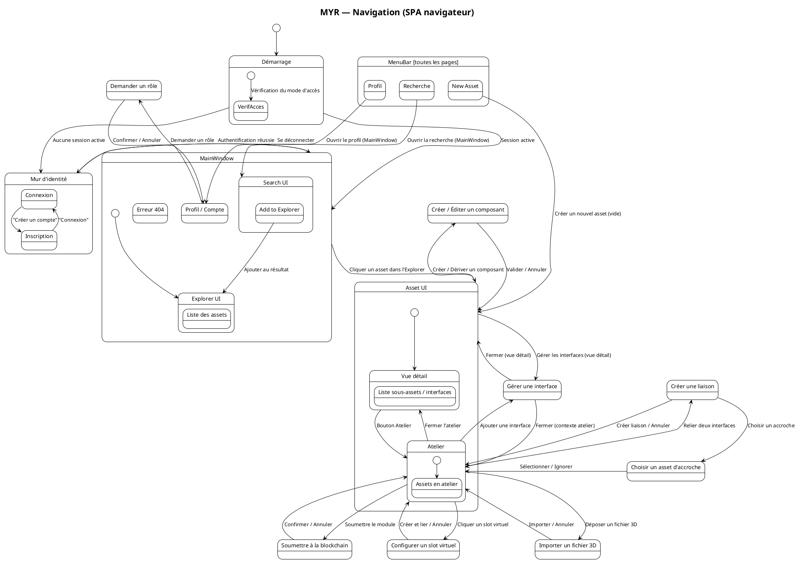
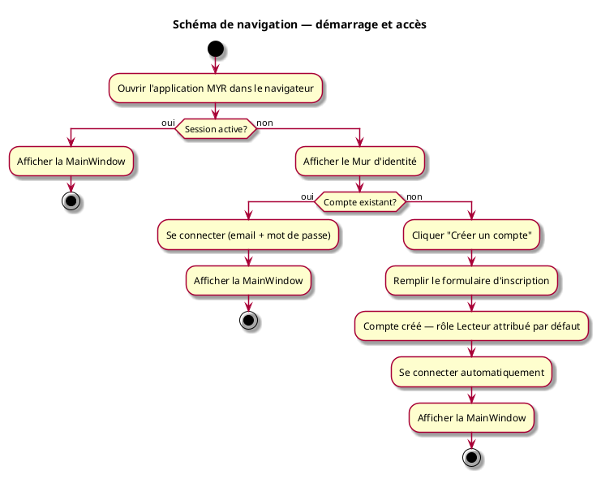

---
categorie: Interface Graphique
titre: "Schéma de navigation"
probabilite: 5
impact: 5
importance: 25
etat: relire
---

# Schéma de navigation

L'interface MYR est accessible depuis un navigateur web. Le client n'installe rien : il se connecte à l'adresse du serveur MYR de son organisation.

## Diagramme de navigation

## Légende des écrans

| Écran | Rôle | UC associé |
|---|---|---|
| Mur d'identité | Contrôle d'accès — affiché si réseau actif et pas de session | UCA01, UCA02 |
| MenuBar | Barre persistante (toutes les pages) — recherche, profil, création d'asset | UCA03, UCA07 |
| MainWindow | Vue principale — recherche et exploration des assets du réseau | — |
| Search UI | Saisie de critères, affichage des résultats, ajout à l'Explorer | UCREC01–05 |
| Explorer UI | Liste des assets ajoutés depuis la recherche, point d'entrée vers Asset UI | UCCL01 |
| Asset UI | Page dédiée à un asset — détail, sous-assets, interfaces, accès à l'Atelier | UCCL01 |
| Atelier (embarqué dans Asset UI) | Composition et assemblage d'un module — liaisons entre interfaces | UCMOD01, UCMOD06, UCAM01–08 |
| Profil / Compte | Informations du compte utilisateur et rôles attribués | UCA03, UCA07, UCA08 |
| Créer / Éditer un composant | Formulaire de création ou d'édition d'un composant | UCCE01–06 |
| Soumettre à la blockchain | Confirmation de l'ancrage blockchain d'un module | UCMOD06 |
| Gérer une interface | Ajout ou édition d'une interface sur un asset | UCAM03 |
| Configurer un slot virtuel | Matérialisation d'un slot virtuel en interface physique | UCAM03 |
| Créer une liaison | Création d'une liaison entre deux interfaces | UCAM01 |
| Choisir un asset d'accroche | Sélection optionnelle d'un fastener pour une liaison | UCAM07 |
| Importer un fichier 3D | Import d'un fichier de modélisation par glisser-déposer | UCAM04, UCAM06 |
| Demander un rôle | Formulaire de demande de rôle (attribution automatique ou validation admin) | UCA08 |

## Modes d'accès au démarrage

| Mode | Condition | Comportement |
|---|---|---|
| Session active | Token JWT valide en mémoire | La MainWindow s'affiche directement |
| Connexion | Compte existant, pas de session | L'utilisateur saisit email + mot de passe — provisionnement blockchain transparent à la première connexion |
| Inscription | Aucun compte | L'utilisateur crée un compte — validé automatiquement avec le rôle **Lecteur** par défaut |

> Un rôle supplémentaire peut être demandé depuis le profil (voir UCA08).

## Diagramme d'activités

