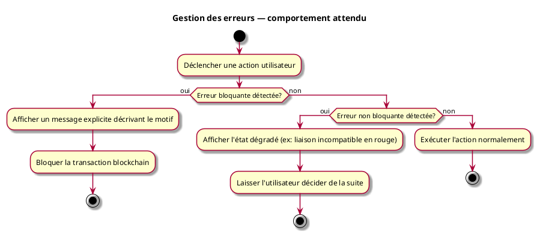

---
categorie: Interface Graphique
titre: "Gestion des erreurs — comportements attendus"
probabilite: 5
impact: 4
importance: 20
etat: relire
---

# Gestion des erreurs

Ce document centralise les situations d'erreur et le comportement attendu du système face à chacune. Les flux d'erreur détaillés se trouvent dans les UC correspondants.

## Tableau des erreurs

| # | Situation | Comportement attendu | UC associé |
|---|---|---|---|
| E01 | Hash du fichier déjà présent sur le réseau | Bloquer l'ajout, notifier l'administrateur — suspicion de plagiat | UCCE01 |
| E02 | Similarité de forme supérieure à 50 % avec un asset existant | Bloquer l'ajout, notifier l'administrateur — suspicion de plagiat | UCCE01 |
| E03 | Licence de l'asset dérivé incompatible avec la licence du parent | Bloquer la transaction avant soumission, afficher le motif d'incompatibilité | UCCE02 |
| E04 | Asset parent introuvable lors d'une dérivation | Bloquer la dérivation avant soumission, message d'erreur explicite | UCCE01 |
| E05 | Interfaces incompatibles dans une liaison | La liaison n'est pas créée ; le motif d'incompatibilité est affiché | UCAM01 |
| E06 | Liaison devenue incompatible après modification d'une interface | La liaison reste visible, marquée en rouge — elle n'est pas supprimée automatiquement | UCAM01, UCAM03 |
| E07 | Interface déjà utilisée dans une autre liaison | Empêcher la liaison, message : "Cette interface est déjà utilisée" | UCAM01 |
| E08 | Droits insuffisants pour effectuer une action | Message d'erreur explicite, aucune transaction émise | UCA05 |
| E09 | Identité blockchain (wallet) non trouvée | Proposer la procédure d'enrollment ou l'import d'un certificat existant | UCA02 |
| E10 | Peer du réseau déconnecté (durée < seuil configuré) | Attendre le retour et resynchroniser automatiquement | — |
| E11 | Peer du réseau déconnecté (durée > seuil configuré) | Marquer le peer comme injoignable, proposer à l'administrateur de le recréer | UCADM01 |
| E12 | Module soumis sans aucune liaison entre composants | Bloquer la soumission, message : "Au moins une liaison est requise" | UCMOD06 |

## Principes généraux

- **Toute erreur bloquante** s'affiche avec un message explicite décrivant le motif — jamais un message générique.
- **Aucune transaction blockchain n'est émise** tant qu'une erreur bloquante n'est pas résolue.
- **Les erreurs non bloquantes** (E06 — liaison incompatible) ne suppriment pas les données existantes : l'état dégradé est affiché et laissé à la discrétion de l'utilisateur.
- **Les erreurs réseau** (E10, E11) sont distinguées selon leur durée pour éviter de déclencher une alerte lors d'une coupure transitoire.

## Diagramme d'activités

