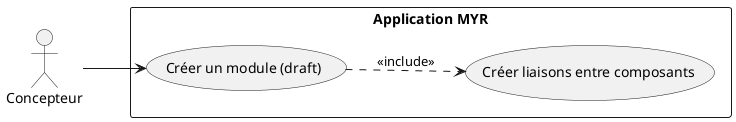
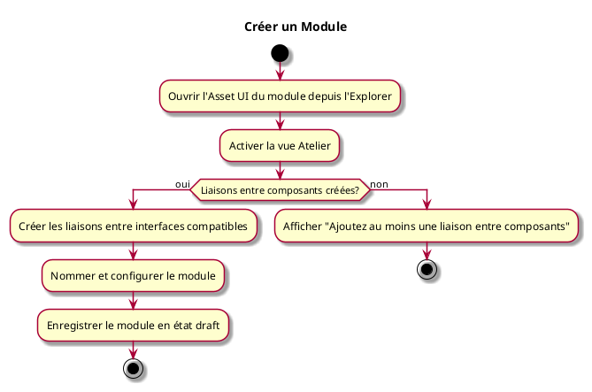

---
categorie: Module
titre: "Créer un Module"
probabilite: 3
impact: 5
importance: 15
etat: relire
---

# Créer un Module

## Diagramme d'acteurs

## Contexte

Assemblage de plusieurs composants ou de Modules existants selon les compatibilités de leurs interfaces pour créer un Module à part entière.

Un module nouvellement créé est en état **draft** (brouillon) : il existe dans l'atelier mais n'est pas encore ancré sur la blockchain. L'état draft est modifiable à volonté — le concepteur peut ajouter, retirer ou reconfigurer des liaisons autant de fois que nécessaire avant de publier.

Lorsque le module est prêt, la soumission à la blockchain (voir UCMOD06) est une étape distincte et explicite. Elle crée une **ModuleVersion** immuable — snapshot figé et horodaté de l'assemblage, non modifiable après publication. Toute évolution ultérieure nécessite la création d'une nouvelle version.

## Pré-conditions

- Être connecté au réseau
- Avoir les droits de création
- Avoir des composants ou modules existants dans l'atelier

## Scénario

**Étape initiale :** L'utilisateur ouvre l'Asset UI du module depuis l'Explorer, puis clique le bouton **Atelier** pour activer la vue d'assemblage embarquée

### Flux nominal — Module créé (draft)

1. L'utilisateur crée les liaisons entre les interfaces compatibles des composants
2. Les interfaces non compatibles se grisent lors des tentatives de liaison
3. L'utilisateur nomme et configure le module
4. Le module est enregistré localement en état **draft**

### Flux erreur — Aucune liaison créée

1. Le système ne permet pas de nommer ou sauvegarder un module sans au moins un assemblage
2. Message d'information : "Ajoutez au moins une liaison entre composants"

## Post-conditions

- Le module est en état **draft** dans l'atelier
- Les interfaces libres du module sont visibles
- Le module n'est pas encore visible sur le réseau (soumission requise — voir UCMOD06)

## Diagramme d'activités

