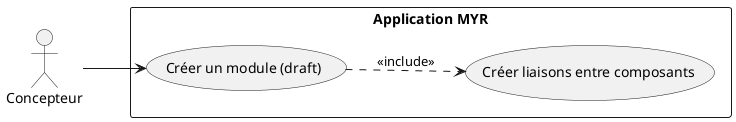
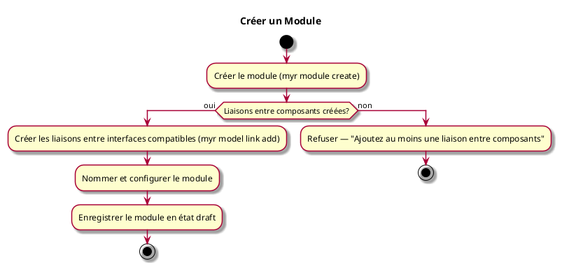

---
categorie: Module
titre: "Créer un Module"
probabilite: 3
impact: 5
importance: 15
etat: relire
---

# Créer un Module

## Diagramme d'acteurs

## Contexte

Assemblage de plusieurs composants ou de Modules existants selon les compatibilités de leurs interfaces pour créer un Module à part entière.

Un module nouvellement créé est en état **draft** (brouillon) : il existe localement mais n'est pas encore ancré sur la blockchain. L'état draft est modifiable à volonté — le concepteur peut ajouter, retirer ou reconfigurer des liaisons autant de fois que nécessaire avant de publier.

Lorsque le module est prêt, la soumission à la blockchain (voir UCMOD06) est une étape distincte et explicite. Elle crée une **ModuleVersion** immuable — snapshot figé et horodaté de l'assemblage, non modifiable après publication. Toute évolution ultérieure nécessite la création d'une nouvelle version.

## Pré-conditions

- Être connecté au réseau
- Avoir les droits de création
- Avoir des composants ou modules existants

## Scénario

**Étape initiale :** `myr module create --name <nom> --channel <id> [--owner-id <id>] [--description <texte>] [--license <id>]` est exécutée (ou l'appel API équivalent), pour le compte du Concepteur

### Flux nominal — Module créé (draft)

1. Le module est initialisé en état **draft**
2. Les liaisons entre les interfaces compatibles des composants sont créées (`myr module instance add` puis `myr model link add`, voir UCAM01)
3. Le module est nommé et configuré
4. Le module est enregistré en état **draft**

### Flux erreur — Aucune liaison créée

1. Le service refuse de nommer ou sauvegarder un module sans au moins un assemblage
2. Message d'erreur : "Ajoutez au moins une liaison entre composants"

## Post-conditions

- Le module est en état **draft**
- Les interfaces libres du module sont visibles
- Le module n'est pas encore visible sur le réseau (soumission requise — voir UCMOD06)

## Diagramme d'activités

