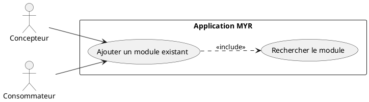
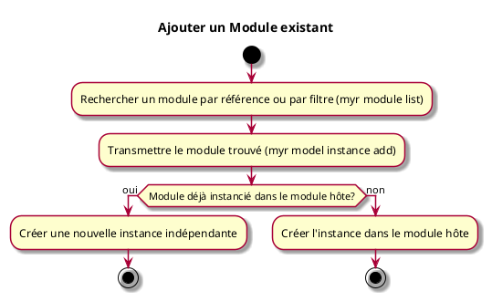

---
categorie: Module
titre: "Ajouter un Module existant"
probabilite: 3
impact: 5
importance: 15
etat: relire
---

# Ajouter un Module existant

## Diagramme d'acteurs

## Contexte

Un Module déjà existant (Contrôleurs, Caméra, Visserie...) peut être ajouté comme instance dans un module hôte, par une action directe sur ce dernier.

## Pré-conditions

- Être connecté au réseau
- Module existant et disponible sur le réseau ou une boutique partenaire

## Scénario

**Étape initiale :** Un module existant est recherché par référence ou par filtre (`myr module list` / `myr model list`, ou l'appel API équivalent — voir UCREC01/UCCL01), pour le compte du Concepteur ou du Consommateur

### Flux nominal — Module ajouté

1. `myr model instance add <moduleID> <assetID>` (ou l'appel API équivalent) est exécutée avec le module trouvé — une nouvelle instance est créée dans le module hôte
2. Une fois les liaisons créées (`myr model link add`, voir UCAM01), elles sont rattachées au module hôte avec `myr module add-assembly <moduleID> <connID>`

### Flux alternatif — Module déjà instancié dans le module hôte

1. Le module ciblé possède déjà une instance dans le module hôte
2. `myr model instance add` crée une nouvelle instance indépendante à chaque appel, y compris si le module est déjà présent — chaque instance a ses propres connexions indépendantes

## Post-conditions

- Le module est disponible en tant qu'instance dans le module hôte

## Diagramme d'activités

