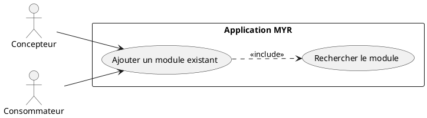
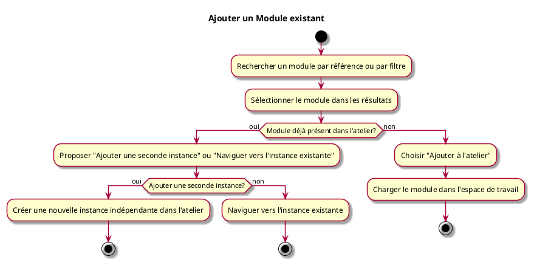

---
categorie: Module
titre: "Ajouter un Module existant"
probabilite: 3
impact: 5
importance: 15
etat: relire
---

# Ajouter un Module existant

## Diagramme d'acteurs

## Contexte

Ajouter un Module déjà existant dans des boutiques ou sur le réseau (Contrôleurs, Caméra, Visserie...) à son espace de travail.

## Pré-conditions

- Être connecté au réseau
- Module existant et disponible sur le réseau ou une boutique partenaire

## Scénario

**Étape initiale :** L'utilisateur recherche un module existant par référence ou par filtre

### Flux nominal — Module ajouté

1. L'utilisateur sélectionne le module dans les résultats
2. Il choisit "Ajouter à l'atelier"
3. Le module est chargé dans l'espace de travail

### Flux alternatif — Module déjà présent dans l'atelier

1. L'utilisateur sélectionne un module déjà instancié dans l'atelier
2. Le système détecte la présence d'une instance existante et propose deux options :
   - Ajouter une seconde instance indépendante du même module
   - Naviguer vers l'instance déjà présente
3. L'utilisateur choisit "Ajouter une seconde instance"
4. Une nouvelle instance est créée dans l'atelier avec ses propres connexions indépendantes

## Post-conditions

- Le module est disponible dans l'espace de travail de l'utilisateur

## Diagramme d'activités

