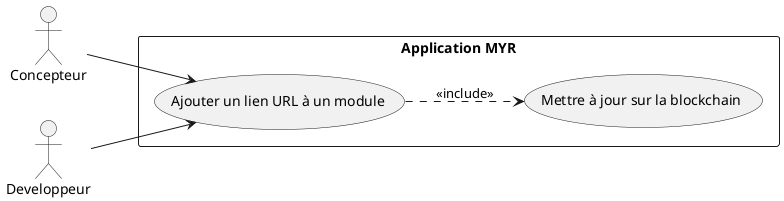
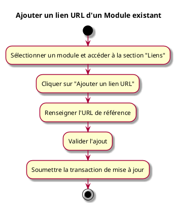

---
categorie: Module
titre: "Ajouter un lien URL d'un Module existant"
probabilite: 2
impact: 5
importance: 10
etat: relire
---

# Ajouter un lien URL d'un Module existant

## Diagramme d'acteurs

## Contexte

Ajouter une ou plusieurs URL de référence (fiche produit, boutique, documentation) à un Module existant sur le réseau.

## Pré-conditions

- Être connecté au réseau
- Avoir les droits d'édition sur le module

## Scénario

**Étape initiale :** L'utilisateur sélectionne un module et accède à la section "Liens"

### Flux nominal — URL ajoutée

1. L'utilisateur clique sur "Ajouter un lien URL"
2. Il renseigne l'URL de référence
3. Il valide l'ajout
4. La transaction de mise à jour est soumise

## Post-conditions

- L'URL est associée au module sur le réseau

## Diagramme d'activités

