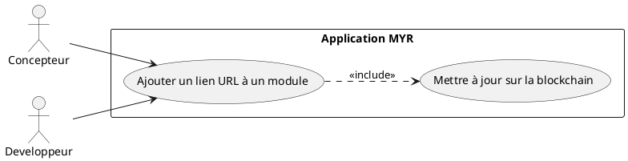
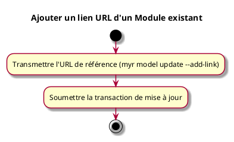

---
categorie: Module
titre: "Ajouter un lien URL d'un Module existant"
probabilite: 2
impact: 5
importance: 10
etat: relire
---

# Ajouter un lien URL d'un Module existant

## Diagramme d'acteurs

## Contexte

Ajouter une ou plusieurs URL de référence (fiche produit, boutique, documentation) à un Module existant sur le réseau.

## Pré-conditions

- Être connecté au réseau
- Avoir les droits d'édition sur le module

## Scénario

**Étape initiale :** `myr model update <moduleID> --add-link <url>` est exécutée (ou l'appel API équivalent), pour le compte du propriétaire du module

### Flux nominal — URL ajoutée

1. L'URL de référence est transmise
2. L'URL est ajoutée aux liens de référence du module
3. La transaction de mise à jour est soumise

### Flux erreur — Droits insuffisants ou URL invalide

1. Le service refuse la mise à jour et retourne un message d'erreur explicite

## Post-conditions

- L'URL est associée au module sur le réseau

## Diagramme d'activités

