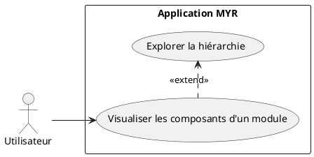
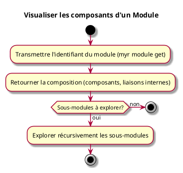

---
categorie: Module
titre: "Visualiser les composants d'un Module"
probabilite: 2
impact: 5
importance: 10
---

# Visualiser les composants d'un Module

## Diagramme d'acteurs

## Contexte

Un Module est composé de composants visualisables. L'utilisateur peut explorer la structure interne d'un module pour en comprendre la composition.

## Pré-conditions

- Être connecté au réseau
- Avoir un identifiant de module

## Scénario

**Étape initiale :** `myr module get <id>` est exécutée (ou l'appel API équivalent), en lecture seule

### Flux nominal — Composition retournée

1. La composition du module (composants constitutifs, liaisons internes) est retournée
2. `myr module interfaces <id>` complète la vue avec les interfaces exposées
3. Les sous-modules éventuels peuvent être explorés récursivement (`myr module get <sousModuleID>`)

## Post-conditions

- La composition complète du module est visible

## Diagramme d'activités

