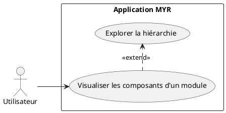
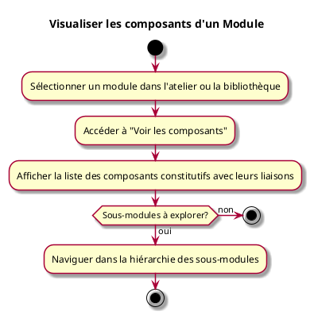

---
categorie: Module
titre: "Visualiser les composants d'un Module"
probabilite: 2
impact: 5
importance: 10
---

# Visualiser les composants d'un Module

## Diagramme d'acteurs

## Contexte

Un Module est composé de composants visualisables. L'utilisateur peut explorer la structure interne d'un module pour en comprendre la composition.

## Pré-conditions

- Être connecté au réseau
- Avoir un module sélectionné

## Scénario

**Étape initiale :** L'utilisateur sélectionne un module dans l'atelier ou la bibliothèque

### Flux nominal — Vue composants affichée

1. L'utilisateur accède à "Voir les composants"
2. La liste des composants constitutifs est affichée avec leurs liaisons
3. L'utilisateur peut naviguer dans la hiérarchie (sous-modules éventuels)

## Post-conditions

- La composition complète du module est visible

## Diagramme d'activités

