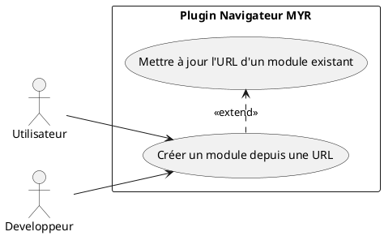
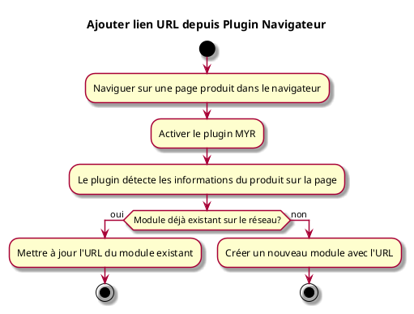

---
categorie: Module
titre: "Ajouter lien URL depuis Plugin Navigateur"
probabilite: 2
impact: 2
importance: 4
etat: relire
---

# Ajouter lien URL depuis Plugin Navigateur

## Diagramme d'acteurs

## Contexte

Un Module peut être ajouté depuis le navigateur via un plugin. Si le Module existe déjà, MYR met à jour l'URL du Module existant.

## Pré-conditions

- Être connecté au réseau MYR
- Plugin navigateur MYR installé et activé
- Être sur une page produit dans le navigateur

## Scénario

**Étape initiale :** L'utilisateur navigue sur une page produit dans son navigateur

### Flux nominal — Nouveau module depuis URL

1. L'utilisateur active le plugin MYR
2. Le plugin détecte les informations du produit sur la page
3. Le module n'existe pas encore : un nouveau module est créé avec l'URL

### Flux nominal — Module existant mis à jour

1. Le plugin détecte que le module correspond à un existant sur le réseau
2. L'URL du module existant est mise à jour

## Post-conditions

- Le module est créé ou mis à jour avec l'URL de la page produit

## Diagramme d'activités

