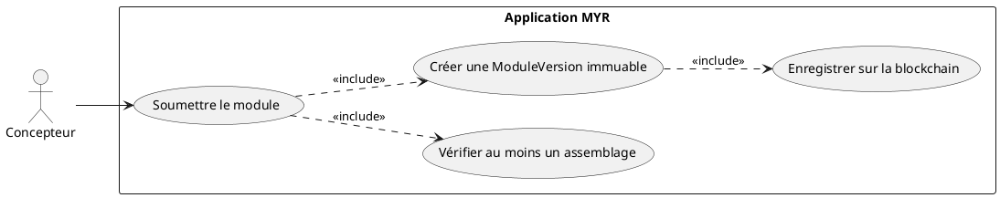
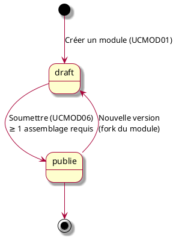
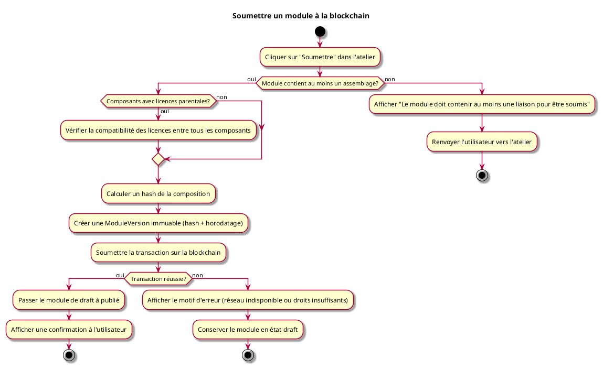

---
categorie: Module
titre: "Soumettre un module à la blockchain"
probabilite: 3
impact: 5
importance: 15
etat: relire
---

# Soumettre un module à la blockchain

## Diagramme d'acteurs

## Contexte

Un module en état **draft** (voir UCMOD01) peut être soumis à la blockchain par son auteur. Cette soumission crée une **ModuleVersion** immuable horodatée avec un hash de l'assemblage. Une fois soumis, le module est visible sur le réseau et ne peut plus être modifié — toute évolution nécessite une nouvelle version.

## Pré-conditions

- Être connecté au réseau
- Être propriétaire du module
- Le module doit être en état **draft**
- Le module doit contenir **au moins un assemblage** (liaison entre composants)

## Scénario

**Étape initiale :** L'utilisateur clique sur "Soumettre" dans l'atelier (bouton de soumission du module)

### Flux nominal — Soumission réussie

1. Le système vérifie que le module contient au moins un assemblage
2. Un hash de la composition est calculé
3. Une `ModuleVersion` immuable est créée avec le hash et l'horodatage
4. La transaction est soumise sur la blockchain
5. Le module passe de l'état **draft** à l'état **publié**
6. Une confirmation est affichée à l'utilisateur

### Flux alternatif — Module avec composants sous licences parentales

1. Le module contient des composants dérivés d'assets parents avec des licences définies
2. Avant la soumission, le système vérifie automatiquement la compatibilité des licences entre tous les composants du module
3. Toutes les licences sont compatibles : la soumission se poursuit normalement
4. La transaction blockchain inclut la liste des dépendances de licences vérifiées

### Flux erreur — Aucun assemblage

1. Le système détecte l'absence de liaison entre composants
2. Message d'erreur : "Le module doit contenir au moins une liaison pour être soumis"
3. L'utilisateur est renvoyé vers l'atelier (voir UCMOD01)

### Flux erreur — Échec de la transaction blockchain

1. La transaction échoue (réseau indisponible, droits insuffisants)
2. Message d'erreur explicite avec le motif
3. Le module reste en état **draft** — aucune donnée n'est perdue

## Post-conditions

- La `ModuleVersion` est enregistrée sur la blockchain de manière immuable
- Le module est visible sur le réseau par les autres utilisateurs
- Toute modification ultérieure nécessite la création d'une nouvelle version

## Diagramme

### Cycle de vie d'un module

### Diagramme d'activités

