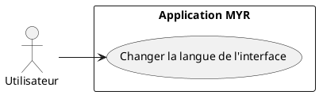
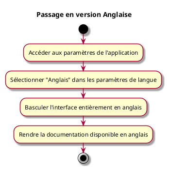

---
categorie: Paramètres
titre: "Passage en version Anglaise"
probabilite: 5
impact: 4
importance: 20
---

# Passage en version Anglaise

## Diagramme d'acteurs

## Contexte

L'interface et la documentation MYR sont disponibles en version anglaise pour permettre une utilisation internationale.

## Pré-conditions

application ouverte dans le navigateur

## Scénario

**Étape initiale :** L'utilisateur accède aux paramètres de l'application

### Flux nominal — Basculement en anglais

1. L'utilisateur sélectionne "Anglais" dans les paramètres de langue
2. L'interface bascule entièrement en anglais
3. La documentation est également disponible en anglais

## Post-conditions

- L'application est entièrement disponible en anglais

## Diagramme d'activités

