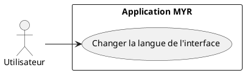
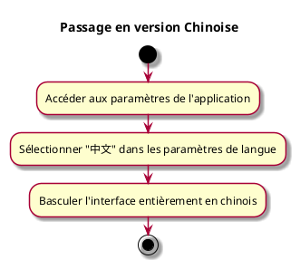

---
categorie: Paramètres
titre: "Passage en version Chinoise"
probabilite: 1
impact: 1
importance: 1
---

# Passage en version Chinoise

## Diagramme d'acteurs

## Contexte

L'interface et la documentation MYR sont disponibles en version chinoise.

## Pré-conditions

- Application MYR installée

## Scénario

**Étape initiale :** L'utilisateur accède aux paramètres de l'application

### Flux nominal — Basculement en chinois

1. L'utilisateur sélectionne "中文" dans les paramètres de langue
2. L'interface bascule entièrement en chinois

## Post-conditions

- L'application est entièrement disponible en chinois

## Diagramme d'activités

