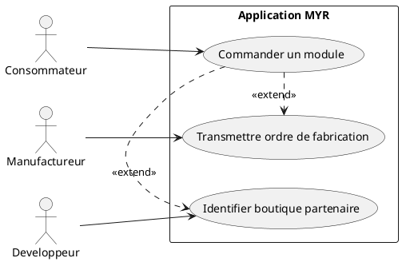
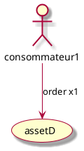
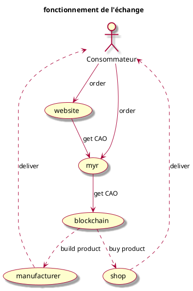
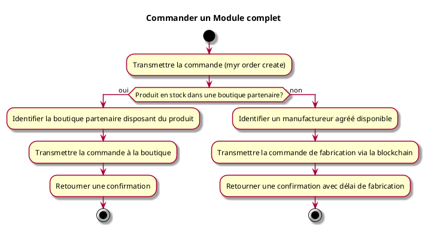

---
categorie: Propriété Intellectuelle
titre: "Commander un Module complet"
probabilite: 5
impact: 5
importance: 25
---

# Commander un Module complet

## Diagramme d'acteurs

## Contexte

Commande d'un module complet via le réseau MYR, impliquant soit l'achat sur une boutique existante, soit la fabrication par un manufactureur agréé.

Conformément au principe de parité CLI/REST (CLAUDE.md — « le CLI n'est pas un citoyen de seconde zone par rapport à l'API »), une commande de ce type doit pouvoir être reproduite en CLI pour le compte d'un consommateur, au même titre que via l'interface graphique.

## Pré-conditions

- Être connecté au réseau
- Module disponible à la commande
- Adresse de livraison renseignée

## Scénario

**Étape initiale :** Une commande de module est transmise (`myr order create <moduleID>` ou `POST /api/orders`)

### Flux nominal — Produit en stock

1. Le système identifie la boutique partenaire disposant du produit
2. La commande est transmise à la boutique
3. Une confirmation de commande est retournée

### Flux nominal — Fabrication nécessaire

1. Le système identifie un manufactureur agréé disponible
2. La commande de fabrication est transmise via la blockchain
3. Une confirmation avec délai de fabrication est retournée

## Post-conditions

- La commande est enregistrée sur la blockchain
- L'utilisateur reçoit une confirmation
- La livraison est en cours de traitement

## Diagrammes

### Commande d'un asset unitaire par un consommateur

### Flux complet — commande via boutique partenaire ou API MYR

### Diagramme d'activités

