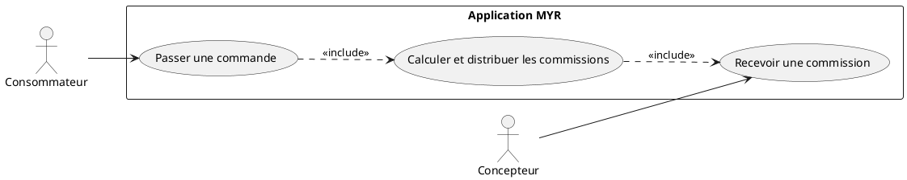
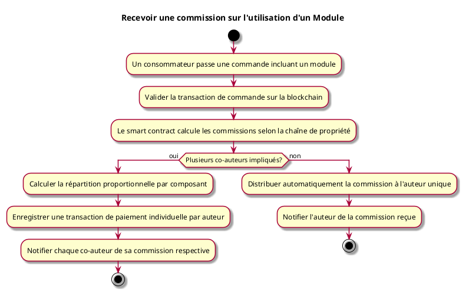

---
categorie: Propriété Intellectuelle
titre: "Recevoir une commission sur l'utilisation d'un Module"
probabilite: 5
impact: 5
importance: 25
---

# Recevoir une commission sur l'utilisation d'un Module

## Diagramme d'acteurs

## Contexte

L'auteur d'un module ou composant reçoit automatiquement une commission à chaque commande ou utilisation commerciale, gérée par smart contract.

Conformément au principe de parité CLI/REST, la consultation des commissions reçues doit aussi être possible en CLI pour le compte d'un concepteur, au même titre que via l'interface graphique.

## Pré-conditions

- Être propriétaire d'un module ou composant avec un prix défini
- Une commande intégrant le module/composant est passée

## Scénario

**Étape initiale :** Un consommateur passe une commande incluant un module

### Flux nominal — Commission distribuée

1. La transaction de commande est validée sur la blockchain
2. Le smart contract calcule les commissions selon la chaîne de propriété
3. Les commissions sont distribuées automatiquement aux auteurs de chaque composant/module
4. L'auteur reçoit une notification de commission reçue

### Flux alternatif — Commission répartie entre plusieurs co-auteurs

1. Le module commandé implique plusieurs auteurs (composants créés par différents concepteurs)
2. Le système calcule la répartition des commissions selon les règles définies sur chaque composant
3. Chaque co-auteur reçoit sa part proportionnelle à son apport dans le module
4. Les transactions de paiement sont enregistrées individuellement sur la blockchain pour chaque auteur

## Post-conditions

- La commission est créditée à l'auteur de manière immuable sur la blockchain

## Diagramme d'activités

