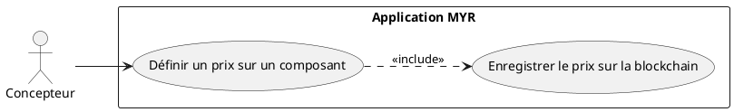
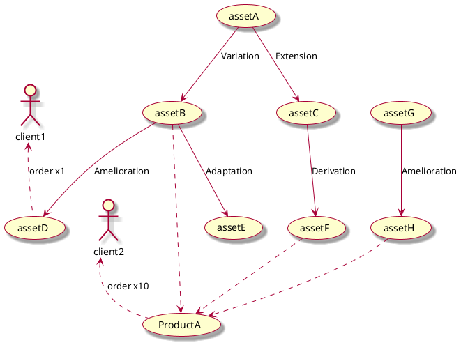
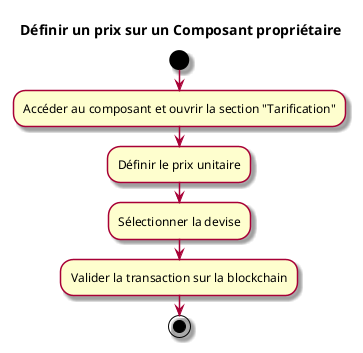

---
categorie: Propriété Intellectuelle
titre: "Définir un prix sur un Composant proprietaire"
probabilite: 3
impact: 5
importance: 15
etat: relire
---

# Définir un prix sur un Composant proprietaire

## Diagramme d'acteurs

## Contexte

L'auteur d'un composant peut définir un prix unitaire pour l'utilisation commerciale ou la commande de celui-ci, enregistré sur la blockchain.

## Pré-conditions

- Être connecté au réseau
- Être propriétaire du composant
- Avoir les droits de tarification

## Scénario

**Étape initiale :** L'utilisateur accède à son composant et ouvre la section "Tarification"

### Flux nominal — Prix défini

1. L'utilisateur définit le prix unitaire
2. Il sélectionne la devise
3. Il valide la transaction sur la blockchain

## Post-conditions

- Le prix est enregistré sur le réseau et appliqué lors des commandes

## Diagrammes

### Arbre de dérivation des assets et impact sur la tarification

Le prix d'un composant dérivé doit tenir compte des licences et commissions définies sur chaque composant parent dans la chaîne de dérivation.

### Diagramme d'activités

