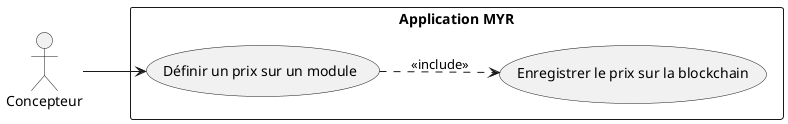
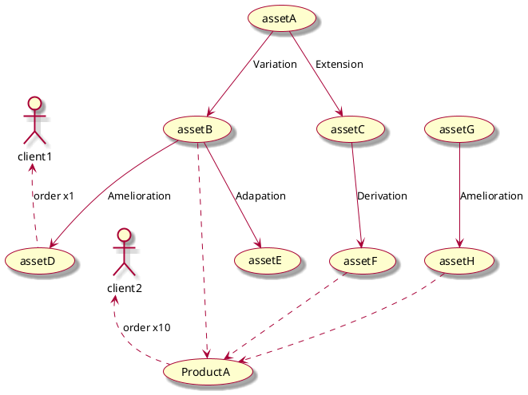
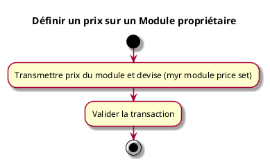

---
categorie: Propriété Intellectuelle
titre: "Définir un prix sur un Module proprietaire"
probabilite: 3
impact: 5
importance: 15
etat: relire
---

# Définir un prix sur un Module proprietaire

## Diagramme d'acteurs

## Contexte

L'auteur d'un module peut définir un prix pour l'utilisation commerciale ou la commande de celui-ci.

Conformément au principe de parité CLI/REST (CLAUDE.md), la définition d'un prix sur un module doit être exposable en CLI au même titre que via l'interface graphique.

## Pré-conditions

- Être connecté au réseau
- Être propriétaire du module
- Avoir les droits de tarification

## Scénario

**Étape initiale :** `myr module price set <id> <montant> --currency <devise>` est exécutée (ou l'appel API équivalent), pour le compte du propriétaire du module

### Flux nominal — Prix défini

1. Le prix du module et la devise sont transmis
2. La transaction est validée

## Post-conditions

- Le prix du module est enregistré sur le réseau
- Le prix agrège les commissions des composants constitutifs

## Diagrammes

### Arbre de dérivation des assets et agrégation du prix d'un module

Le prix d'un module (ProductA) agrège les prix unitaires de chaque composant constitutif (assetB, assetF, assetH) ainsi que leurs commissions respectives remontées via la chaîne de dérivation.

### Diagramme d'activités

