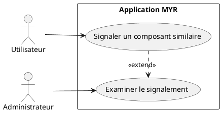
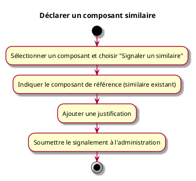

---
categorie: Propriété Intellectuelle
titre: "Déclarer un composant similaire"
probabilite: 1
impact: 5
importance: 5
etat: relire
---

# Déclarer un composant similaire

## Diagramme d'acteurs

## Contexte

Signaler un composant similaire à un autre non pris en compte par le système. Forme de protection communautaire pour garantir la pertinence et l'intégrité du réseau.

## Pré-conditions

- Être connecté au réseau
- Avoir identifié deux composants similaires non liés dans le système

## Scénario

**Étape initiale :** L'utilisateur sélectionne un composant et choisit "Signaler un similaire"

### Flux nominal — Signalement soumis

1. L'utilisateur indique le composant de référence (similaire existant)
2. Il ajoute une justification
3. Le signalement est soumis à l'administration

## Post-conditions

- Le signalement est enregistré et soumis à l'examen de l'administration

## Diagramme d'activités

