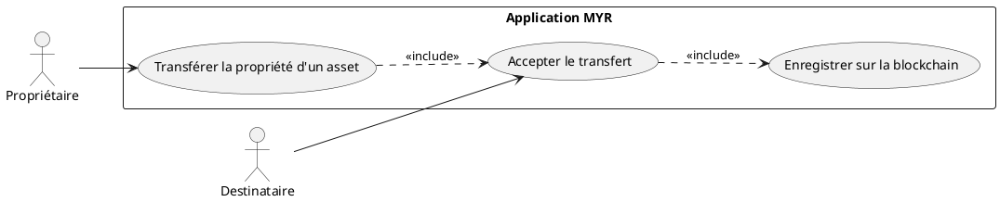
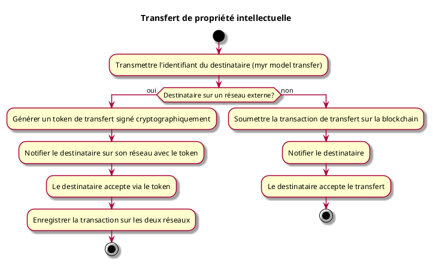

---
categorie: Propriété Intellectuelle
titre: "Transfert de propriété intellectuelle"
probabilite: 1
impact: 3
importance: 3
etat: relire
---

# Transfert de propriété intellectuelle

## Diagramme d'acteurs

## Contexte

Un propriétaire peut transférer la propriété intellectuelle d'un composant ou module à un autre utilisateur ou organisation.

Conformément au principe de parité CLI/REST, le transfert de propriété d'un asset doit pouvoir être initié en CLI pour le compte d'un propriétaire, au même titre que via l'interface graphique.

## Pré-conditions

- Être connecté au réseau
- Être propriétaire du composant/module à transférer

## Scénario

**Étape initiale :** `myr model transfer <id> <destinataireID>` est exécutée (ou l'appel API équivalent), pour le compte du propriétaire

### Flux nominal — Transfert réussi

1. L'identifiant du destinataire est transmis
2. La transaction de transfert est soumise sur la blockchain
3. Le destinataire est notifié et accepte le transfert

### Flux alternatif — Transfert vers un réseau externe

1. L'identifiant du destinataire appartient à un utilisateur sur un réseau externe
2. Le système génère un token de transfert signé cryptographiquement
3. Le destinataire est notifié sur son réseau et accepte le transfert via le token
4. La propriété est transférée avec enregistrement de la transaction sur les deux réseaux

## Post-conditions

- La propriété est transférée et enregistrée de manière immuable sur la blockchain
- L'ancien propriétaire perd les droits d'édition

## Diagramme d'activités

