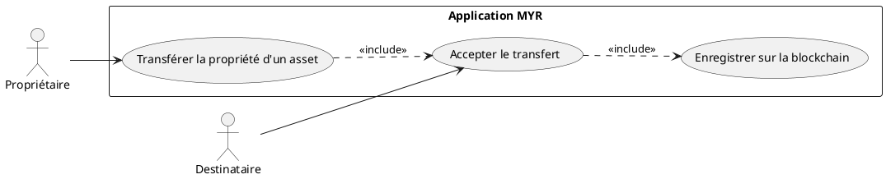
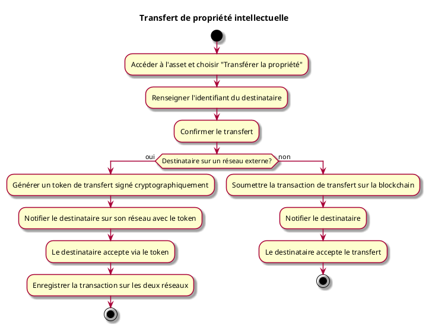

---
categorie: Propriété Intellectuelle
titre: "Transfert de propriété intellectuelle"
probabilite: 1
impact: 3
importance: 3
etat: relire
---

# Transfert de propriété intellectuelle

## Diagramme d'acteurs

## Contexte

Un propriétaire peut transférer la propriété intellectuelle d'un composant ou module à un autre utilisateur ou organisation.

## Pré-conditions

- Être connecté au réseau
- Être propriétaire du composant/module à transférer

## Scénario

**Étape initiale :** Le propriétaire accède à son asset et choisit "Transférer la propriété"

### Flux nominal — Transfert réussi

1. Le propriétaire renseigne l'identifiant du destinataire
2. Il confirme le transfert
3. La transaction de transfert est soumise sur la blockchain
4. Le destinataire reçoit une notification et accepte le transfert

### Flux alternatif — Transfert vers un réseau externe

1. L'identifiant du destinataire appartient à un utilisateur sur un réseau externe
2. Le système génère un token de transfert signé cryptographiquement
3. Le destinataire est notifié sur son réseau et accepte le transfert via le token
4. La propriété est transférée avec enregistrement de la transaction sur les deux réseaux

## Post-conditions

- La propriété est transférée et enregistrée de manière immuable sur la blockchain
- L'ancien propriétaire perd les droits d'édition

## Diagramme d'activités

