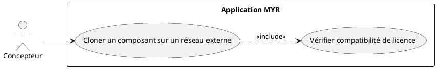
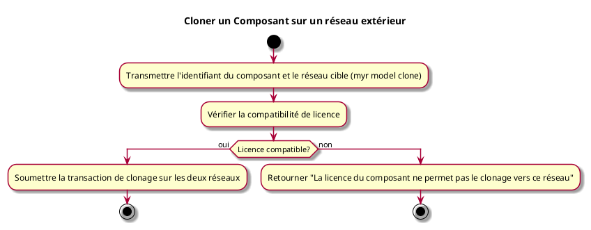

---
categorie: Propriété Intellectuelle
titre: "Cloner un Composant sur un réseau exterieur"
probabilite: 1
impact: 2
importance: 2
etat: relire
---

# Cloner un Composant sur un réseau exterieur

## Diagramme d'acteurs

## Contexte

Un composant peut être cloné vers un réseau MYR externe sous réserve de compatibilité de licence.

Conformément au principe de parité CLI/REST, le clonage d'un composant vers un réseau externe doit pouvoir être déclenché en CLI, au même titre que via l'interface graphique.

## Pré-conditions

- Être connecté au réseau source
- Avoir les droits de clonage (licence compatible)
- Réseau de destination accessible

## Scénario

**Étape initiale :** `myr model clone <id> --target-network <id>` est exécutée (ou l'appel API équivalent)

### Flux nominal — Clonage autorisé

1. Le réseau de destination est transmis
2. Le système vérifie la compatibilité de licence
3. La transaction de clonage est soumise sur les deux réseaux

### Flux alternatif — Réseau cible déjà connu (profil de connexion existant)

1. Le réseau cible est déjà référencé dans les profils de connexion locaux
2. Le clonage est initié directement, sans saisie manuelle des informations du réseau cible
3. Le composant est publié sur le réseau cible avec le même UUID et les métadonnées originales

### Flux erreur — Licence incompatible

1. Erreur métier : "La licence du composant ne permet pas le clonage vers ce réseau"

## Post-conditions

- Le composant est disponible sur le réseau de destination
- La traçabilité de l'origine est conservée

## Diagramme d'activités

