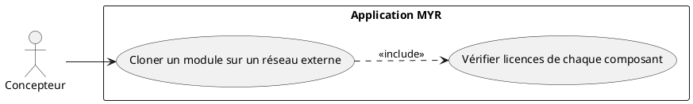
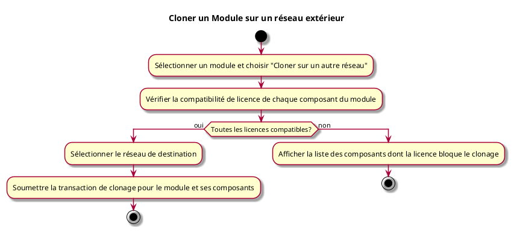

---
categorie: Propriété Intellectuelle
titre: "Cloner un Module sur un réseau exterieur"
probabilite: 1
impact: 2
importance: 2
etat: relire
---

# Cloner un Module sur un réseau exterieur

## Diagramme d'acteurs

## Contexte

Un module peut être cloné vers un réseau MYR externe, ce qui implique la vérification de licence de tous ses composants constitutifs.

## Pré-conditions

- Être connecté au réseau source
- Avoir les droits de clonage sur le module et tous ses composants
- Réseau de destination accessible

## Scénario

**Étape initiale :** L'utilisateur sélectionne un module et choisit "Cloner sur un autre réseau"

### Flux nominal — Clonage autorisé

1. Le système vérifie la compatibilité de licence de chaque composant du module
2. L'utilisateur sélectionne le réseau de destination
3. La transaction de clonage est soumise pour le module et ses composants

### Flux erreur — Licence incompatible sur un composant

1. Message d'erreur listant les composants dont la licence bloque le clonage

## Post-conditions

- Le module et ses composants sont disponibles sur le réseau de destination

## Diagramme d'activités

