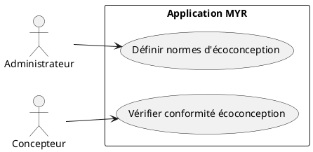
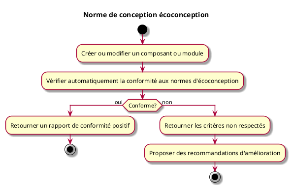

---
categorie: Propriété Intellectuelle
titre: "Norme de conception écoconception"
probabilite: 2
impact: 1
importance: 2
---

# Norme de conception écoconception

## Diagramme d'acteurs

## Contexte

Les composants et modules peuvent être soumis à des normes d'écoconception définies par l'administrateur du réseau pour promouvoir l'économie circulaire.

Conformément au principe de parité CLI/REST, la définition de normes d'écoconception par l'administrateur ainsi que la vérification de conformité doivent être exposables en CLI, au même titre que via l'interface graphique.

## Pré-conditions

- Normes d'écoconception définies par l'administrateur du réseau
- Composant ou module en cours de création ou de modification

## Scénario

**Étape initiale :** Un composant ou module est créé ou modifié (`myr model add`/`myr model update`, ou l'appel API équivalent)

### Flux nominal — Conforme

1. Le système vérifie automatiquement la conformité aux normes d'écoconception
2. Un rapport de conformité positif est retourné

### Flux nominal — Non conforme

1. Le système retourne les critères non respectés
2. Des recommandations d'amélioration sont proposées

## Post-conditions

- La conformité écoconception est vérifiée et documentée sur le réseau

## Diagramme d'activités

