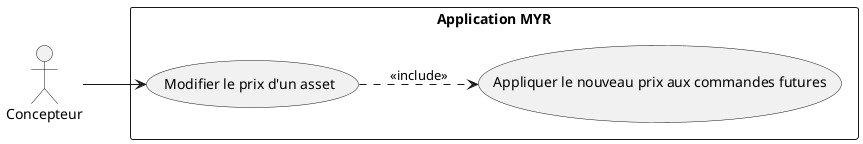
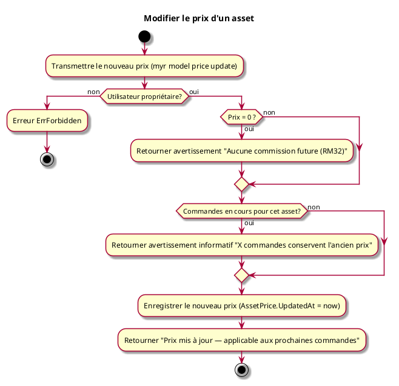

# Modifier le prix d'un asset

## Diagramme d'acteurs

## Contexte

L'auteur d'un composant ou d'un module peut modifier son prix à tout moment. Contrairement aux transactions blockchain (immuables), le prix est stocké localement et est mutable. La modification n'affecte que les commandes passées après la mise à jour — les commandes existantes conservent le prix enregistré à leur création (voir RM31).

Conformément au principe de parité CLI/REST, la modification du prix d'un asset doit être exposable en CLI au même titre que sa définition initiale (UCPI04/UCPI05) et que l'interface graphique.

## Pré-conditions

- Être connecté au réseau
- Être propriétaire de l'asset
- L'asset doit avoir un prix déjà défini (UCPI04 ou UCPI05) **ou** être en cours de première tarification

## Scénario

**Étape initiale :** `myr model price update <id> <montant>` (ou `myr module price update <id> <montant>`) est exécutée (ou l'appel API équivalent), pour le compte du propriétaire

### Flux nominal — Prix mis à jour

1. Le prix actuel est retourné (ou "non défini" si premier paramétrage)
2. Le nouveau prix unitaire est transmis — la devise est celle du réseau, non modifiable (RM33)
3. Le nouveau prix est enregistré localement avec la date de mise à jour (`AssetPrice.UpdatedAt`)
4. La réponse confirme : "Prix mis à jour — applicable aux prochaines commandes"

### Flux nominal — Passage à gratuit (prix = 0)

1. Le nouveau prix transmis est 0
2. Le service avertit : "En définissant un prix nul, aucune commission ne sera générée pour les commandes futures (RM32)"
3. L'asset passe en libre accès — aucune commission future

### Flux erreur — Utilisateur non propriétaire

1. Erreur `ErrForbidden`

### Flux erreur — Commandes en cours

1. Des commandes sont en cours pour cet asset (`OrderItem.Status != delivered`)
2. Le service retourne un avertissement informatif : "X commande(s) en cours conserveront l'ancien prix"
3. La modification est autorisée — les commandes en cours ne sont pas bloquées

## Post-conditions

- Le nouveau prix est actif pour toutes les commandes créées après la mise à jour
- Les commandes existantes ou livrées conservent leur `OrderItem.UnitPrice` d'origine (RM31)
- Si price = 0 : l'asset passe en libre accès (RM32)

## Règles métier applicables

- **RM31** — Modification de prix applicable aux commandes futures uniquement
- **RM32** — Asset à prix nul → libre accès, aucune commission
- **RM33** — Devise non modifiable par l'auteur (définie par le réseau)

## Diagramme d'activités

