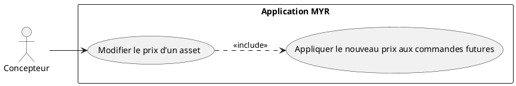
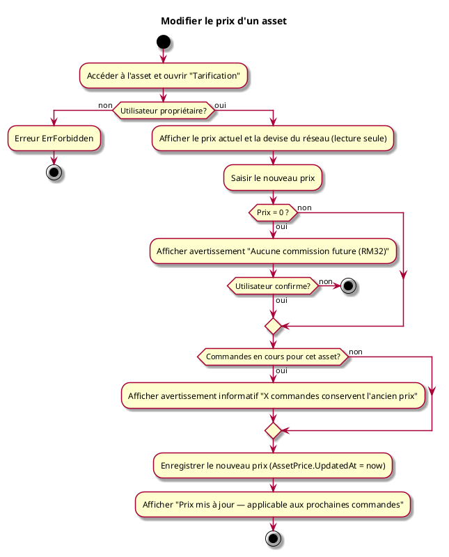

# Modifier le prix d'un asset

## Diagramme d'acteurs

## Contexte

L'auteur d'un composant ou d'un module peut modifier son prix à tout moment. Contrairement aux transactions blockchain (immuables), le prix est stocké localement et est mutable. La modification n'affecte que les commandes passées après la mise à jour — les commandes existantes conservent le prix enregistré à leur création (voir RM31).

## Pré-conditions

- Être connecté au réseau
- Être propriétaire de l'asset
- L'asset doit avoir un prix déjà défini (UCPI04 ou UCPI05) **ou** être en cours de première tarification

## Scénario

**Étape initiale :** L'utilisateur accède à son asset (composant ou module) et ouvre la section "Tarification"

### Flux nominal — Prix mis à jour

1. Le prix actuel est affiché (ou "non défini" si premier paramétrage)
2. L'utilisateur saisit le nouveau prix unitaire
3. La devise est affichée en lecture seule (devise du réseau — RM33)
4. L'utilisateur valide
5. Le nouveau prix est enregistré localement avec la date de mise à jour (`AssetPrice.UpdatedAt`)
6. Un message de confirmation indique : "Prix mis à jour — applicable aux prochaines commandes"

### Flux nominal — Passage à gratuit (prix = 0)

1. L'utilisateur saisit 0 comme nouveau prix
2. Le système affiche un avertissement : "En définissant un prix nul, aucune commission ne sera générée pour les commandes futures (RM32)"
3. L'utilisateur confirme
4. L'asset passe en libre accès — aucune commission future

### Flux erreur — Utilisateur non propriétaire

1. Le bouton "Tarification" n'est pas affiché
2. En cas de tentative directe via API : erreur `ErrForbidden`

### Flux erreur — Commandes en cours

1. Des commandes sont en cours pour cet asset (`OrderItem.Status != delivered`)
2. Le système affiche un avertissement informatif : "X commande(s) en cours conserveront l'ancien prix"
3. La modification est autorisée — les commandes en cours ne sont pas bloquées

## Post-conditions

- Le nouveau prix est actif pour toutes les commandes créées après la mise à jour
- Les commandes existantes ou livrées conservent leur `OrderItem.UnitPrice` d'origine (RM31)
- Si price = 0 : l'asset passe en libre accès (RM32)

## Règles métier applicables

- **RM31** — Modification de prix applicable aux commandes futures uniquement
- **RM32** — Asset à prix nul → libre accès, aucune commission
- **RM33** — Devise non modifiable par l'auteur (définie par le réseau)

## Diagramme d'activités

