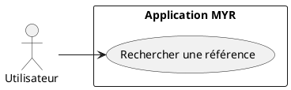
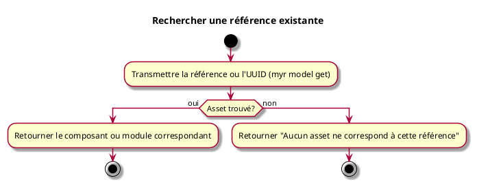

---
categorie: Recherche
titre: "Rechercher une référence existante"
probabilite: 4
impact: 5
importance: 20
etat: relire
---

# Rechercher une référence existante

## Diagramme d'acteurs

## Contexte

La recherche par référence permet de trouver précisément un composant ou un module par son identifiant ou sa référence exacte.

## Pré-conditions

- Être connecté au réseau

## Scénario

**Étape initiale :** `myr model get <id>` est exécutée avec la référence ou l'UUID recherché (ou l'appel API équivalent)

### Flux nominal — Référence trouvée

1. Le composant ou module correspondant est retourné

### Flux nominal — Référence introuvable

1. La réponse indique qu'aucun asset ne correspond à cette référence

### Flux alternatif — Référence exacte inconnue

1. `myr model list [--channel <id>]` permet de parcourir les assets du canal pour retrouver la référence recherchée

## Post-conditions

- L'asset trouvé est disponible pour consultation ou édition (voir UCCE02)

## Diagramme d'activités

