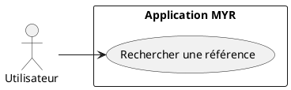
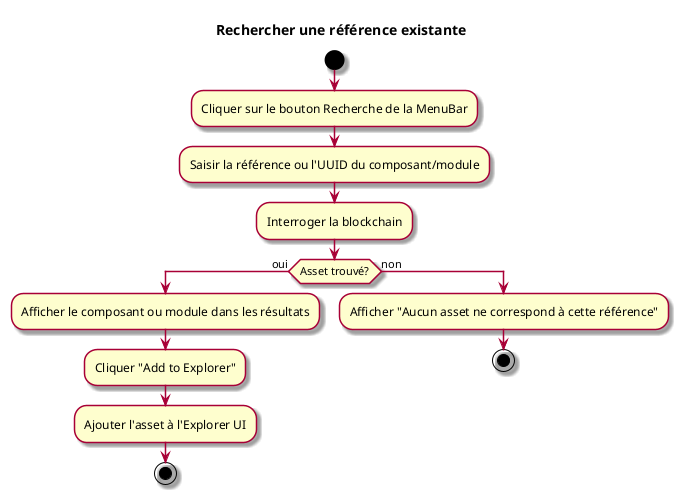

---
categorie: Recherche
titre: "Rechercher une référence existante"
probabilite: 4
impact: 5
importance: 20
etat: relire
---

# Rechercher une référence existante

## Diagramme d'acteurs

## Contexte

La recherche par référence permet de trouver précisément un composant ou un Module par son identifiant ou sa référence exacte. Les résultats peuvent ensuite être ajoutés à l'**Explorer UI** pour une consultation ou une édition ultérieure.

## Pré-conditions

- Être connecté au réseau

## Scénario

**Étape initiale :** L'utilisateur clique sur le bouton **Recherche** de la MenuBar — la Search UI s'ouvre dans la MainWindow

### Flux nominal — Référence trouvée

1. L'utilisateur saisit la référence ou l'UUID du composant/module
2. Le système interroge la blockchain
3. Le composant ou module correspondant est affiché dans les résultats
4. L'utilisateur clique **Add to Explorer** — l'asset est ajouté à l'Explorer UI
5. L'utilisateur peut cliquer l'asset dans l'Explorer pour ouvrir son Asset UI

### Flux nominal — Référence introuvable

1. Un message indique qu'aucun asset ne correspond à cette référence

## Post-conditions

- L'asset trouvé est ajouté à l'Explorer UI
- L'utilisateur peut ouvrir son Asset UI depuis l'Explorer pour consulter le détail ou accéder à l'Atelier

## Diagramme d'activités

