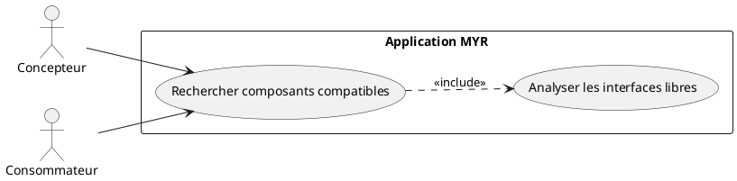
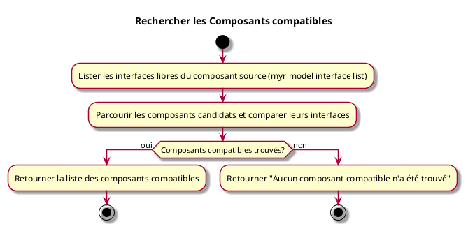

---
categorie: Recherche
titre: "Rechercher les Composants compatibles"
probabilite: 3
impact: 4
importance: 12
etat: relire
---

# Rechercher les Composants compatibles

## Diagramme d'acteurs

## Contexte

À partir d'un composant sélectionné, lister tous les composants du réseau dont les interfaces sont compatibles avec les interfaces libres de celui-ci.

## Pré-conditions

- Être connecté au réseau
- Avoir un identifiant de composant source
- Recherche approximative uniquement — sans application de l'algorithme de compatibilité (voir flux nominal)

## Scénario

**Étape initiale :** Les interfaces libres du composant source sont listées (`myr model interface list <assetID>`, ou l'appel API équivalent)

### Flux nominal — Compatibles trouvés (recherche approximative)

1. Les interfaces libres du composant source sont récupérées
2. Les composants candidats du réseau sont parcourus (`myr model list [--channel <id>]`) et leurs interfaces comparées (`myr model interface list <candidateID>`)
3. La liste des composants compatibles est retournée — cette comparaison manuelle n'applique pas l'algorithme de compatibilité (RM10/RM11)

### Flux nominal — Aucun compatible

1. La réponse indique qu'aucun composant compatible n'a été trouvé

## Post-conditions

- La liste des composants compatibles avec le composant sélectionné est affichée

## Diagramme d'activités

