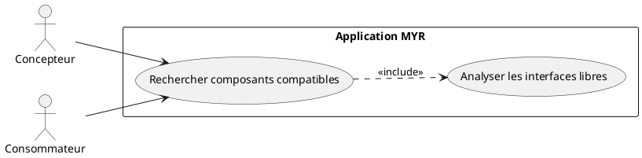
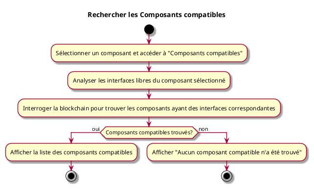

---
categorie: Recherche
titre: "Rechercher les Composants compatibles"
probabilite: 3
impact: 4
importance: 12
etat: relire
---

# Rechercher les Composants compatibles

## Diagramme d'acteurs

## Contexte

À partir d'un composant sélectionné, lister tous les composants du réseau dont les interfaces sont compatibles avec les interfaces libres de celui-ci.

## Pré-conditions

- Être connecté au réseau
- Avoir un composant sélectionné

## Scénario

**Étape initiale :** L'utilisateur sélectionne un composant et accède à "Composants compatibles"

### Flux nominal — Compatibles trouvés

1. Le système analyse les interfaces libres du composant sélectionné
2. Il interroge la blockchain pour trouver les composants ayant des interfaces correspondantes
3. La liste des composants compatibles est affichée

### Flux nominal — Aucun compatible

1. Un message indique qu'aucun composant compatible n'a été trouvé

## Post-conditions

- La liste des composants compatibles avec le composant sélectionné est affichée

## Diagramme d'activités

