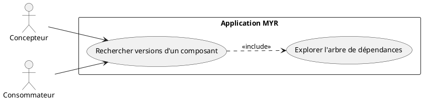
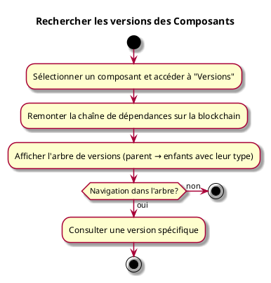

---
categorie: Recherche
titre: "Rechercher les versions des Composants"
probabilite: 3
impact: 4
importance: 12
---

# Rechercher les versions des Composants

## Diagramme d'acteurs

## Contexte

À partir d'un composant, lister les différentes versions qu'elles soient parentes ou enfants (améliorations, variations, adaptations, extensions, dérivations...).

## Pré-conditions

- Être connecté au réseau
- Avoir un composant sélectionné

## Scénario

**Étape initiale :** L'utilisateur sélectionne un composant et accède à "Versions"

### Flux nominal — Arbre de versions affiché

1. Le système remonte la chaîne de dépendances sur la blockchain
2. L'arbre de versions est affiché (parent → enfants avec leur type : AMELIORATION, VARIATION, ADAPTATION...)
3. L'utilisateur peut naviguer dans l'arbre et consulter chaque version

## Post-conditions

- L'arbre complet des versions du composant est visible

## Diagramme d'activités

