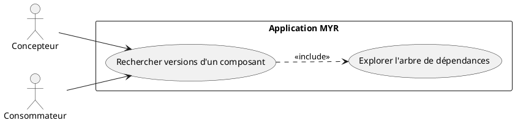
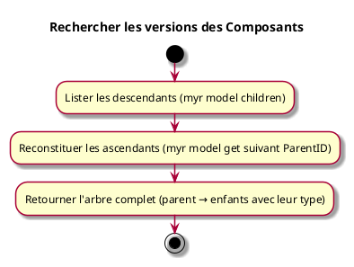

---
categorie: Recherche
titre: "Rechercher les versions des Composants"
probabilite: 3
impact: 4
importance: 12
---

# Rechercher les versions des Composants

## Diagramme d'acteurs

## Contexte

À partir d'un composant, lister les différentes versions qu'elles soient parentes ou enfants (améliorations, variations, adaptations, extensions, dérivations...).

## Pré-conditions

- Être connecté au réseau
- Avoir un identifiant de composant

## Scénario

**Étape initiale :** Les descendants directs et récursifs sont listés (`myr model children <parentID>`, ou l'appel API équivalent)

### Flux nominal — Arbre de versions retourné

1. Les descendants directs et récursifs sont listés (`myr model children <parentID>`)
2. Les ascendants sont reconstitués par appels successifs à `myr model get <parentID>` en suivant `ParentID` jusqu'à la racine
3. L'arbre complet (ascendants + descendants) est recomposé, avec le type de chaque version (AMELIORATION, VARIATION, ADAPTATION...)

## Post-conditions

- L'arbre complet des versions du composant est visible

## Diagramme d'activités

