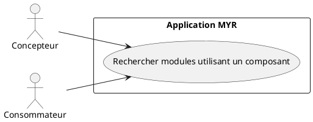
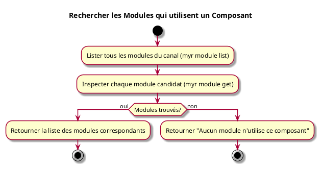

---
categorie: Recherche
titre: "Rechercher les Modules qui utilisent un Composant"
probabilite: 3
impact: 4
importance: 12
---

# Rechercher les Modules qui utilisent un Composant

## Diagramme d'acteurs

## Contexte

À partir d'un composant sélectionné, lister tous les modules du réseau qui l'intègrent dans leur assemblage.

## Pré-conditions

- Être connecté au réseau
- Avoir un identifiant de composant
- Recherche par inspection individuelle des modules — sans filtre serveur dédié (voir flux nominal)

## Scénario

**Étape initiale :** `myr module list` est exécutée pour obtenir tous les modules du canal (ou l'appel API équivalent)

### Flux nominal — Modules trouvés (parité limitée)

1. Tous les modules du canal sont listés
2. Chaque module candidat est inspecté individuellement (`myr module get <id>` — composition, liste des instances) pour vérifier la présence du composant recherché
3. La liste des modules correspondants est retournée

### Flux nominal — Aucun module

1. La réponse indique qu'aucun module n'utilise ce composant

## Post-conditions

- La liste des modules utilisant le composant est visible

## Diagramme d'activités

