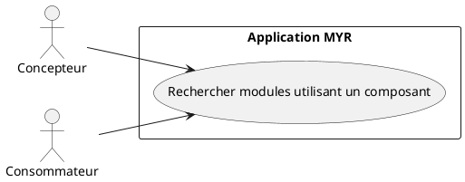
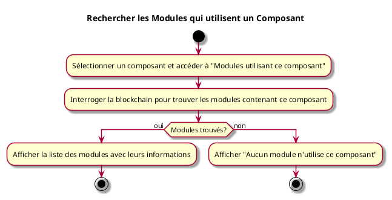

---
categorie: Recherche
titre: "Rechercher les Modules qui utilisent un Composant"
probabilite: 3
impact: 4
importance: 12
---

# Rechercher les Modules qui utilisent un Composant

## Diagramme d'acteurs

## Contexte

À partir d'un composant sélectionné, lister tous les modules du réseau qui l'intègrent dans leur assemblage.

## Pré-conditions

- Être connecté au réseau
- Avoir un composant sélectionné

## Scénario

**Étape initiale :** L'utilisateur sélectionne un composant et accède à "Modules utilisant ce composant"

### Flux nominal — Modules trouvés

1. Le système interroge la blockchain pour trouver les modules contenant ce composant
2. La liste des modules est affichée avec leurs informations

### Flux nominal — Aucun module

1. Un message indique qu'aucun module n'utilise ce composant

## Post-conditions

- La liste des modules utilisant le composant est visible

## Diagramme d'activités

