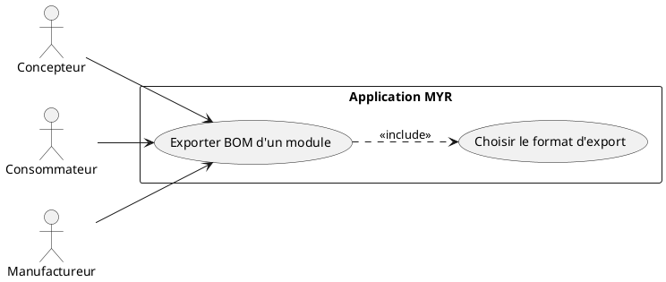
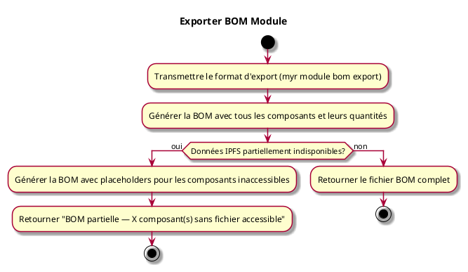

---
categorie: Recherche
titre: "Exporter BOM Module"
probabilite: 4
impact: 3
importance: 12
---

# Exporter BOM Module

## Diagramme d'acteurs

## Contexte

Exporter une "Bill Of Material" (liste des matériaux) d'un Module, listant tous les composants constitutifs avec leurs quantités et références.

## Pré-conditions

- Être connecté au réseau
- Avoir un identifiant de module

## Scénario

**Étape initiale :** `myr module bom export <id> --format csv|xml|pdf` est exécutée (ou l'appel API équivalent)

### Flux nominal — BOM exportée

1. Le format d'export est transmis (CSV, XML, PDF...)
2. La BOM est générée avec tous les composants et leurs quantités
3. Le fichier BOM est retourné

### Flux alternatif — Composants avec données IPFS indisponibles

1. La BOM contient des composants dont les fichiers IPFS ne sont pas accessibles (nœud hors ligne ou données non pinnées)
2. La BOM est générée avec un placeholder pour chaque composant concerné (`fichier: "indisponible"`)
3. Un avertissement est retourné : "X composant(s) sans fichier accessible — BOM partielle"
4. L'export est proposé avec les données disponibles

### Flux alternatif — Reconstitution manuelle

1. Les instances du module sont listées (`myr module get <id>`)
2. Pour chaque instance, les informations du composant sont récupérées (`myr model get <assetID>` — nom, catégorie, hash), en parcourant récursivement les sous-modules
3. Cette reconstitution manuelle ne fournit pas d'agrégation automatique des quantités (RM15)

## Post-conditions

- Le fichier BOM est généré et disponible

## Diagramme d'activités

