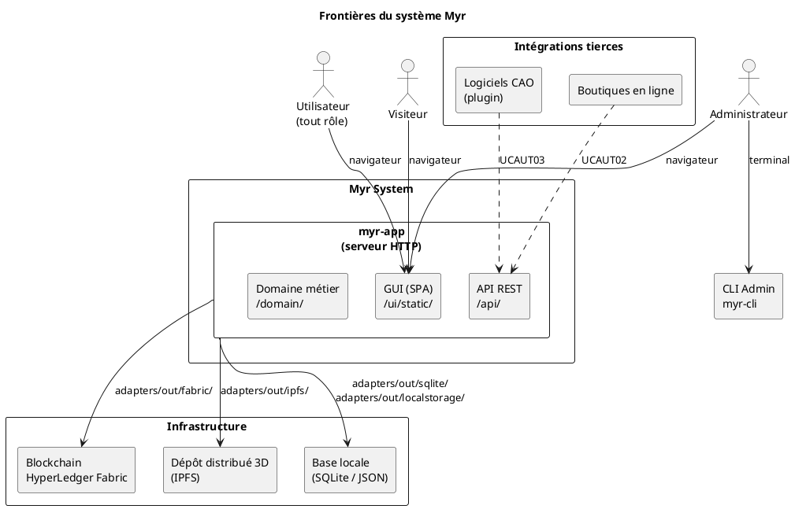
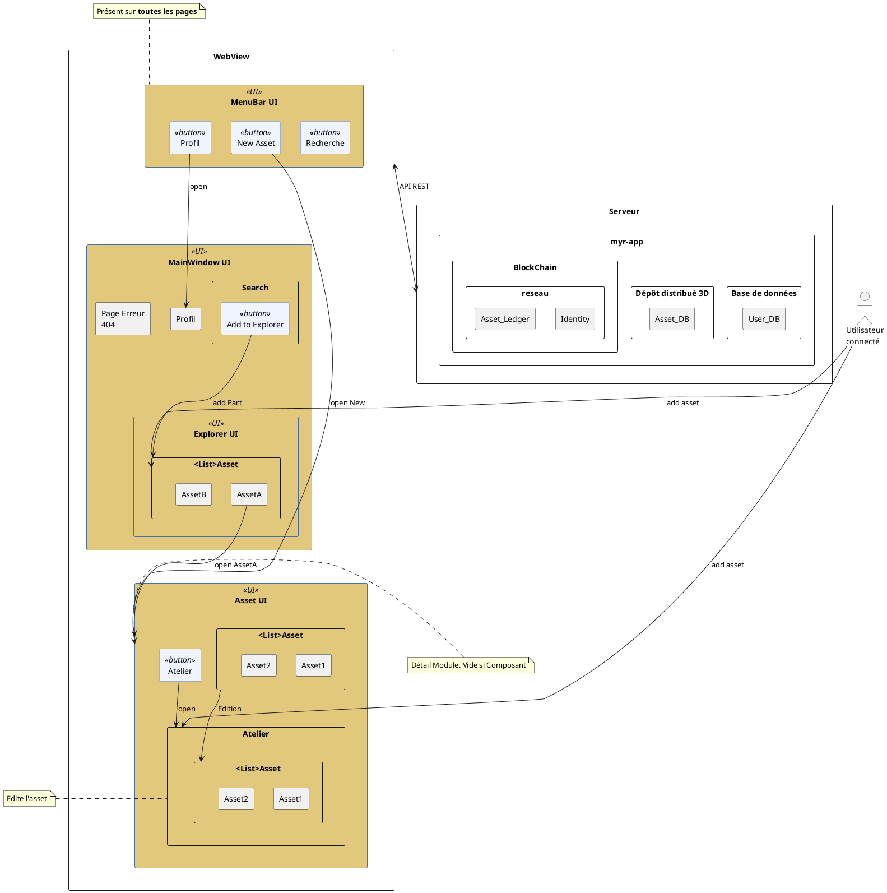

# Analyse des besoins — Myr System

- [1. Objet de l'analyse](#1-objet-de-lanalyse)
- [2. Problème à résoudre](#2-problème-à-résoudre)
  - [2.1 Constat](#21-constat)
  - [2.2 Problèmes spécifiques](#22-problèmes-spécifiques)
  - [2.3 Réponse attendue](#23-réponse-attendue)
- [3. Analyse des acteurs](#3-analyse-des-acteurs)
  - [3.1 Acteurs × objectifs](#31-acteurs--objectifs)
  - [3.2 Acteurs × domaines fonctionnels](#32-acteurs--domaines-fonctionnels)
- [4. Frontières du système](#4-frontières-du-système)
- [5. Analyse fonctionnelle par domaine](#5-analyse-fonctionnelle-par-domaine)
  - [D1 — Compte & Accès](#d1--compte--accès)
  - [D2 — Administration réseau](#d2--administration-réseau)
  - [D3 — Composant (écriture)](#d3--composant-écriture)
  - [D4 — Composant (lecture)](#d4--composant-lecture)
  - [D5 — Atelier (assemblage)](#d5--atelier-assemblage)
  - [D6 — Module](#d6--module)
  - [D7 — Propriété Intellectuelle](#d7--propriété-intellectuelle)
  - [D8 — Recherche](#d8--recherche)
  - [D9 — Automatisation](#d9--automatisation)
  - [D10 — Paramètres](#d10--paramètres)
  - [D11 — Documentation](#d11--documentation)
  - [D12 — Interface Graphique](#d12--interface-graphique)
  - [D13 — Développement autour de Myr](#d13--développement-autour-de-myr)
- [6. Contraintes structurantes](#6-contraintes-structurantes)
  - [6.1 Architecture hexagonale](#61-architecture-hexagonale)
  - [6.2 Blockchain et immuabilité](#62-blockchain-et-immuabilité)
  - [6.3 Modèle de données unifié](#63-modèle-de-données-unifié)
  - [6.4 Interfaces physiques](#64-interfaces-physiques)
- [7. Hiérarchisation des domaines](#7-hiérarchisation-des-domaines)
- [8. Correspondance spec ↔ code existant](#8-correspondance-spec--code-existant)
- [9. Guide de rédaction des use cases](#9-guide-de-rédaction-des-use-cases)

---

## 1. Objet de l'analyse

Ce document constitue l'introduction de la phase d'analyse du projet **Myr System**. Il est produit à partir de l'expression des besoins (`specs/1-Expression/`) selon la méthode Arrington et sert de support direct à la rédaction des use cases détaillés.

**Son rôle :**
- Reformuler le problème métier en termes d'analyse structurée
- Identifier les acteurs, leurs objectifs et les frontières du système
- Décomposer les besoins par domaine fonctionnel avec leur état d'implémentation
- Signaler les contraintes transversales à respecter dans chaque use case
- Fournir un glossaire canonique assurant la cohérence entre specs et code

---

## 2. Problème à résoudre

### 2.1 Constat

La société actuelle repose sur un modèle de production linéaire (fabriquer → vendre → jeter) qui génère gaspillage et obsolescence programmée. Malgré des efforts d'amélioration continue, la traçabilité des composants, leur compatibilité inter-systèmes et la rémunération des auteurs de conceptions ne sont pas traitées de manière systémique.

Les concepteurs de pièces (CAO, firmware, modules électroniques…) n'ont pas d'outil permettant de :
- enregistrer leur création de façon immuable et vérifiable,
- garantir la compatibilité de leurs pièces avec d'autres systèmes,
- automatiser la rémunération lors de la réutilisation ou fabrication de leurs designs.

### 2.2 Problèmes spécifiques

| # | Problème | Acteur impacté |
|---|----------|---------------|
| P1 | Absence de traçabilité immuable des créations et de leur généalogie | Concepteur, Consommateur |
| P2 | Incompatibilité non détectée entre composants lors de l'assemblage | Concepteur |
| P3 | Plagiat non contrôlé — absence de vérification d'unicité à la soumission | Réseau, Administrateur |
| P4 | Rémunération manuelle et opaque des auteurs lors de fabrication | Concepteur, Consommateur |
| P5 | Aucun mécanisme de dérivation légale contrôlée (licences) | Concepteur |
| P6 | Accès à la production (fabrication, livraison) non intégré au cycle de conception | Consommateur, Manufactureur |
| P7 | Impossibilité de tracer la réutilisation d'un composant sur plusieurs réseaux | Réseau |

### 2.3 Réponse attendue

Myr est une plateforme serveur Open-Source (AGPL 3.0) proposant :
1. Un **registre blockchain immuable** des assets (composants et modules) avec généalogie, licences et propriétaires.
2. Un **atelier de composition** permettant d'assembler des composants en modules via des interfaces physiques vérifiées.
3. Un **système de propriété intellectuelle automatisé** — commissions, transferts, clonage inter-réseaux.
4. Une **interface web** sans logiciel client, accessible depuis tout navigateur moderne.
5. Une **API REST** et un **CLI d'administration** pour l'intégration et l'exploitation.

---

## 3. Analyse des acteurs

### 3.1 Acteurs × objectifs

| Acteur | Objectif principal | Droits clés | Rôle code |
|--------|-------------------|-------------|-----------|
| **Visiteur** | Consulter les assets publics d'un réseau | Lecture seule (publique) | aucun token |
| **Lecteur** | Explorer le réseau — rôle par défaut à la création de compte | Lecture authentifiée | `reader` |
| **Concepteur** | Créer, dériver et assembler des assets | Lecture + écriture assets | `designer` |
| **Consommateur** | Trouver, commander des composants et modules | Lecture + commande | `consumer` |
| **Manufactureur** | Produire les assets commandés | Lecture sur demande | `manufacturer` |
| **Développeur** | Intégrer Myr dans ses outils via API/CLI | Lecture + API REST/CLI | `developer` |
| **Administrateur** | Créer et gouverner un réseau | Tous droits sur le réseau | `admin` |

> **Note code :** Le code existant définit les rôles `reader`, `contributor`, `admin`. Le rôle `contributor` est un alias provisoire du rôle **Concepteur** défini dans les specs. Les rôles `consumer`, `manufacturer`, `developer` sont à créer. Le rôle `reader` est correct — il correspond au rôle **Lecteur** attribué par défaut (RM21).

### 3.2 Acteurs × domaines fonctionnels

| Domaine | Visiteur | Lecteur | Concepteur | Consommateur | Manufactureur | Développeur | Admin |
|---------|:--------:|:-------:|:----------:|:------------:|:-------------:|:-----------:|:-----:|
| D1 Compte & Accès | ✓ | ✓ | ✓ | ✓ | ✓ | ✓ | ✓ |
| D2 Administration réseau | | | | | | | ✓ |
| D3 Composant écriture | | | ✓ | | | | |
| D4 Composant lecture | ✓ | ✓ | ✓ | ✓ | ✓ | ✓ | ✓ |
| D5 Atelier (assemblage) | | | ✓ | | | | |
| D6 Module | | ✓ | ✓ | ✓ | | ✓ | |
| D7 Propriété Intellectuelle | | ✓ | ✓ | ✓ | ✓ | | ✓ |
| D8 Recherche | | ✓ | ✓ | ✓ | ✓ | ✓ | |
| D9 Automatisation | | | ✓ | ✓ | ✓ | ✓ | |
| D10 Paramètres | | ✓ | ✓ | ✓ | ✓ | ✓ | ✓ |
| D11 Documentation | | ✓ | ✓ | ✓ | ✓ | ✓ | |
| D12 Interface Graphique | ✓ | ✓ | ✓ | ✓ | ✓ | ✓ | ✓ |
| D13 Dev autour de Myr | | | | | | ✓ | ✓ |

---

## 4. Frontières du système

### Ce que Myr fait

- Servir une interface web sans logiciel client (navigateur uniquement)
- Enregistrer des assets (composants, modules) sur une blockchain Fabric
- Vérifier l'unicité (anti-plagiat SHA-256 + SCM) et la compatibilité de licences
- Gérer les interfaces physiques et vérifier la compatibilité d'assemblage
- Automatiser la distribution des commissions à la livraison
- Exposer une API REST et un CLI d'administration
- Gérer les identités (wallets Fabric CA) et les sessions utilisateur

### Ce que Myr ne fait pas

- Effectuer la fabrication physique (déléguée à des manufactureurs partenaires)
- Héberger un éditeur 3D natif (le stockage de fichiers CAO est délégué à un dépôt distribué 3D)
- Gérer les paiements fiat (les transactions monétaires sont hors périmètre — seules les commissions blockchain sont traitées)
- Proposer un logiciel client lourd (pas d'Electron, pas d'application mobile)

### Diagramme de contexte système



---

## 5. Analyse fonctionnelle par domaine

Pour chaque domaine, la structure est :
- **Besoin** : ce que l'acteur cherche à accomplir
- **Service attendu** : ce que le système doit fournir
- **Points d'attention** : contraintes ou risques à traiter dans les use cases
- **Code existant** : état d'implémentation dans le code actuel

---

### D1 — Compte & Accès

**Use cases** : UCA01–UCA08 | **Exigences** : EF01–EF06 | **Règles** : RM20–RM22

**Besoin :** Tout acteur doit pouvoir s'identifier sur un réseau Myr. Les droits d'accès sont contrôlés par rôle.

**Service attendu :**
- Création de compte avec attribution automatique du rôle **Lecteur** (RM21)
- Authentification JWT (email/password) — `JWT_SECRET` requis
- Provisionnement différé de l'identité blockchain : l'identité Fabric CA est créée à la **première connexion**, pas à la création du compte (RM20)
- Contrôle d'accès par rôle sur chaque action (RM22)
- Demande de rôle supplémentaire depuis le profil (UCA08) — auto ou avec validation admin selon config réseau

**Points d'attention :**
- Le rôle Lecteur est attribué à la création — tout autre comportement viole RM21
- Le wallet Fabric n'existe pas avant la première connexion — les use cases ne doivent pas présupposer son existence
- UCA08 dépend de la configuration du réseau (auto vs validation admin) — prévoir les deux flux

**Code existant :** `domain/auth/`, `adapters/out/sqlite/`, `adapters/in/rest/handlers_auth.go` — JWT Register/Login/Refresh/Logout opérationnels. UCA08 (demande de rôle) non implémenté.

---

### D2 — Administration réseau

**Use cases** : UCADM01–UCADM03 | **Exigences** : EF07–EF09

**Besoin :** Un administrateur doit pouvoir créer un réseau Fabric isolé, y ajouter des organisations et étendre sa capacité avec de nouveaux nœuds.

**Service attendu :**
- Création d'un réseau blockchain (channel Fabric, genesis block)
- Ajout d'une organisation membre (MSP, certificats CA)
- Ajout d'un nœud peer ou orderer au réseau existant
- Configuration des règles d'accès du réseau (rôles auto-distribués vs validation)

**Points d'attention :**
- Ces opérations sont irréversibles sur la blockchain — validation stricte avant soumission (RM07)
- L'administrateur est le seul acteur de ce domaine
- La création de réseau est le prérequis de tout autre use case — c'est le premier use case à rédiger

**Code existant :** `domain/channel/`, `domain/network/`, `domain/identity/` — services domaine définis. Aucun endpoint REST ni CLI exposés. Priorité **HAUTE** d'implémentation.

---

### D3 — Composant (écriture)

**Use cases** : UCCE01–UCCE06 | **Exigences** : EF10–EF16 | **Règles** : RM01–RM05

**Besoin :** Un concepteur doit pouvoir enregistrer un composant sur la blockchain, le faire évoluer et définir ses interfaces.

**Service attendu :**
- Import d'un fichier CAO (physique) ou déclaration d'un composant numérique
- Vérification anti-plagiat obligatoire pour tout asset de catégorie `base` : SHA-256 + analyse SCM > 50% (RM01)
- Attribution d'un UUID unique et immuable (RM04)
- Catégorie d'asset obligatoire parmi les 8 types (RM02) — voir §6.3
- `ParentID` obligatoire pour tout asset non-`base` (RM05)
- Vérification de compatibilité de licence pour les assets dérivés (RM03)
- Définition des interfaces physiques d'un composant (UCCE06)

**Points d'attention :**
- L'analyse SCM (similarité structurelle > 50%) est un algorithme métier central — à traiter comme un service domaine indépendant
- Les catégories `amélioration`, `variation`, `adaptation`, `dérivation`, `extension`, `régression`, `découpage` impliquent toutes un `ParentID` — le flux nominal des UC dérivés doit le vérifier en précondition
- La catégorie `découpage` transforme un composant en module (UCAM05) — c'est la seule catégorie déclenchant ce changement d'entité

**Code existant :** `domain/model/service.go` — `AddFull()` implémenté. Vérification de licence (RM03) opérationnelle. Anti-plagiat SHA-256 calculé mais **comparaison avec les assets existants absente** (RM01 incomplet). Catégorie `découpage` absente du code (à ajouter).

---

### D4 — Composant (lecture)

**Use cases** : UCCL01 | **Exigences** : EF17

**Besoin :** Tout acteur (y compris visiteur) doit pouvoir rechercher et consulter les assets disponibles sur un réseau.

**Service attendu :**
- Recherche par filtre (nom, catégorie, tags, licence, auteur…)
- Consultation sans authentification pour les assets publics (Visiteur — UCCL01)
- Consultation avec authentification pour les assets protégés

**Points d'attention :**
- L'accès public (sans JWT) est une exigence explicite — la route `GET /api/components` ne doit pas systématiquement exiger un token
- La distinction public/protégé est définie par la configuration du réseau (paramètre admin)

**Code existant :** `adapters/in/rest/handlers.go` — `GET /api/components` implémenté mais requiert `requireAuth`. Accès visiteur à implémenter.

---

### D5 — Atelier (assemblage)

**Use cases** : UCAM01–UCAM08 | **Exigences** : EF18–EF25 | **Règles** : RM09–RM15

**Besoin :** Un concepteur doit pouvoir placer des composants dans un espace de travail local (l'Atelier), y créer des liaisons entre leurs interfaces et composer un assemblage avant soumission.

**Service attendu :**
- L'Atelier est un espace **local au serveur** — hors blockchain, modifiable librement
- Placement de composants avec gestion d'instances indépendantes (RM15)
- Chaque asset de l'atelier dispose toujours d'au moins un slot virtuel (RM13)
- Création de liaisons entre interfaces : vérification de compatibilité automatique (RM10) selon 5 critères (RM11)
- Interface à usage unique par liaison (RM09)
- Liaison devenant incompatible → `Incompatible: true` sans suppression automatique (RM12)
- Retrait d'un asset → suppression en cascade de toutes ses connexions (RM14)
- Choix d'un asset d'accroche (Fastener) pour une liaison indirecte (UCAM07)

**Points d'attention :**
- Les interfaces incompatibles (`Incompatible: true`) doivent être visibles en rouge dans l'UI — elles restent jusqu'à suppression manuelle
- La vérification RM11 porte sur 5 critères : catégorie + **tag** + type + sens complémentaires + plages de valeurs — le champ `Tag` est actuellement absent de `AssetInterface` dans le code (à ajouter)
- L'Atelier correspond au terme `Workspace` dans le code — les deux termes sont équivalents

**Code existant :** `domain/model/service.go` — liaisons, slots virtuels, cascade opérationnels. `ifacesCompatible()` implémentée (critère tag manquant). `adapters/in/rest/handlers.go` — endpoints Atelier exposés.

---

### D6 — Module

**Use cases** : UCMOD01–UCMOD06 | **Exigences** : EF26–EF29 | **Règles** : RM16–RM19

**Besoin :** Un concepteur doit pouvoir consolider un assemblage de l'Atelier en module, le versionner et le soumettre à la blockchain.

**Service attendu :**
- Création d'un module en état **draft** (RM16) — non visible sur le réseau
- Ajout d'un module existant dans l'Atelier (instances indépendantes — RM15)
- Soumission à la blockchain : exige au moins une liaison (RM17)
- `ModuleVersion` immuable créée à la soumission (hash + horodatage — RM18)
- Toute modification d'un module **soumis** crée une nouvelle version (fork — RM19)
- Visualisation de la composition (composants + liaisons)

**Points d'attention :**
- RM19 est critique : un module soumis doit être en lecture seule — l'Atelier doit interdire toute modification directe et proposer le fork
- La `ModuleVersion` est le seul artefact ancré sur la blockchain pour les modules — les instances Atelier restent côté serveur

**Code existant :** `domain/model/service.go` — `CreateModule()`, `SubmitModule()` opérationnels. RM17 (assemblage requis) vérifiée. RM18 (ModuleVersion) implémentée. **RM19 (fork obligatoire) absente** — un module soumis reste modifiable dans le code actuel.

---

### D7 — Propriété Intellectuelle

**Use cases** : UCPI01–UCPI10 (sauf UCPI03 → reclassifié UCPAR) | **Exigences** : EF30–EF38 | **Règles** : RM23–RM26

**Besoin :** Le système doit automatiser la rémunération des auteurs, permettre le transfert de propriété et tracer le clonage inter-réseaux.

**Service attendu :**
- Commande d'un module (fabrication ou achat stock) — UCPI01
- Distribution automatique des commissions à la livraison, calculée par smart contract (RM23, RM24)
- Définition d'un prix sur un composant ou module propriétaire (UCPI04, UCPI05)
- Signalement d'un composant similaire (UCPI06)
- Transfert définitif de propriété — immuable (RM25)
- Clonage inter-réseaux avec UUID et traçabilité préservés sur les deux réseaux (RM26)
- Respect d'une norme d'écoconception (UCPI10)

**Points d'attention :**
- La distribution de commissions est déclenchée par la **livraison** (UCAUT01) — ce domaine est couplé à D9
- Le smart contract de commission est distinct du service `payment` côté serveur — il réside dans le chaincode Fabric
- RM26 exige une transaction sur **deux réseaux distincts** — le use case doit préciser la séquence

**Code existant :** `domain/payment/service.go` — paiement manuel implémenté. Aucun endpoint REST exposé. Smart contract de commission **absent** du chaincode. Priorité implémentation : HAUTE.

---

### D8 — Recherche

**Use cases** : UCREC01–UCREC05 | **Exigences** : EF39–EF43

**Besoin :** Tout utilisateur authentifié doit pouvoir trouver des assets par critères et explorer leurs relations.

**Service attendu :**
- Recherche par référence, filtre multi-critères (UCREC01)
- Identification des composants compatibles entre eux via leurs interfaces (UCREC02)
- Consultation de l'arbre de versions d'un composant (UCREC03)
- Identification des modules intégrant un composant donné (UCREC04)
- Export de la BOM (Bill of Materials) d'un module (UCREC05)

**Points d'attention :**
- UCREC02 s'appuie sur la logique `ifacesCompatible` (RM11) — réutiliser le même algorithme
- L'export BOM (UCREC05) doit respecter ENF03 (≤ 5 s pour 100 composants)

**Code existant :** `GET /api/components` implémenté (filtrage de base). UCREC02, UCREC04, UCREC05 non exposés.

---

### D9 — Automatisation

**Use cases** : UCAUT01–UCAUT04 | **Exigences** : EF44–EF47

**Besoin :** Le système doit permettre de déclencher la fabrication/livraison automatiquement et d'intégrer des outils externes (CAO, SCM).

**Service attendu :**
- Fabrication et livraison automatique d'un composant commandé (UCAUT01) — déclenche les commissions (RM23)
- Commande en ligne via boutique intégrée (UCAUT02)
- Import de modèle 3D depuis un logiciel CAO (plugin navigateur — UCAUT03)
- Gestion des versions SCM d'un modèle 3D (UCAUT04)

**Points d'attention :**
- UCAUT01 est le déclencheur des commissions (RM23) — la séquence livraison → commission doit être atomique
- UCAUT03 et UCAUT04 impliquent des intégrations tierces (logiciels CAO) — prévoir des interfaces bien délimitées

**Code existant :** Non implémenté.

---

### D10 — Paramètres

**Use cases** : UCPAR01–UCPAR02 | **Exigences** : EF50–EF51

**Besoin :** L'interface doit être disponible en anglais et en chinois.

**Service attendu :**
- Sélection de la langue (anglais par défaut, chinois disponible)
- Persistance du choix utilisateur

**Points d'attention :**
- L'internationalisation impacte l'ensemble des messages de l'UI — à traiter comme une infrastructure transversale

**Code existant :** Non implémenté. Aucun mécanisme i18n côté serveur ou frontend.

---

### D11 — Documentation

**Use cases** : UCDOC01–UCDOC03 | **Exigences** : EF52–EF54

**Besoin :** Les utilisateurs doivent pouvoir accéder à la documentation et à la FAQ depuis l'application.

**Service attendu :**
- Accès à la documentation système depuis l'interface
- FAQ accessible depuis le profil ou l'aide
- Documentation technique pour les développeurs (API, CLI)

**Code existant :** Non implémenté. `cmd/mangen/` génère des man pages pour la CLI.

---

### D12 — Interface Graphique

**Use cases** : UCIG01–UCIG02 | **Exigences** : EF48–EF49 | **ENF** : ENF22, ENF24

**Besoin :** L'interface doit être cohérente, navigable et gérer les erreurs explicitement.

**Service attendu :**
- Navigation via MenuBar (Recherche, Profil, New Asset) présente sur toutes les pages
- Explorer UI pour parcourir les assets
- Asset UI avec Atelier intégré
- Gestion des erreurs 404 et erreurs métier — messages explicites

**Points d'attention :**
- L'interface est une SPA (Single Page Application) en Vanilla JS — pas de framework, pas de bundler
- Compatible Chrome 120+, Firefox 120+, Safari 17+, Edge 120+ (ENF22)
- Le hot-reload est disponible en développement via `MYR_DEV=1`

**Wireframe de navigation :**



**Code existant :** `ui/static/` — SPA servie depuis `myr-app`. Fonctionnel en mode hot-reload (`MYR_DEV=1`).

---

### D13 — Développement autour de Myr

**Use cases** : UCDEV01–UCDEV02 | **Exigences** : EF55–EF56

**Besoin :** Les développeurs tiers et l'administrateur doivent pouvoir exploiter Myr via des interfaces programmatiques.

**Service attendu :**
- API REST documentée et stable pour les intégrations tierces (boutiques, éditeurs CAO, plugins)
- CLI d'administration (`myr-cli`) pour les opérations serveur (réseau, organisation, identités)

**Code existant :** `adapters/in/rest/` — API REST opérationnelle. `adapters/in/cli/` + `cmd/cli/` — CLI cobra en place. `cmd/mangen/` — génération de man pages.

---

## 6. Contraintes structurantes

Ces contraintes s'appliquent à **tous** les use cases. Chaque UC doit les respecter sans les répéter systématiquement.

### 6.1 Architecture hexagonale

Le domaine (`domain/`) ne connaît que des interfaces Go. Aucune dépendance à Fabric, Redis, SQLite ou IPFS dans le domaine. Cette règle est non négociable (ENF18) et vérifiée par script CI (`scripts/ci/check-domain-imports.sh`).

Flux obligatoire : `adapter in (REST/CLI)` → `service domaine` → `adapter out (Fabric/IPFS/SQLite)`.

### 6.2 Blockchain et immuabilité

- Toute soumission blockchain est **définitive** — validation complète côté serveur avant toute transaction (RM07)
- Il n'existe **aucune opération de suppression** — `ErrNotSupported` est retourné (RM08)
- En cas d'échec blockchain, l'état local (draft) est conservé intact (ENF30)

Ces contraintes impactent directement les flux d'erreur de tous les UC d'écriture (UCCE, UCMOD, UCPI).

### 6.3 Modèle de données unifié

L'entité centrale du système est `Model3D` — elle représente à la fois un composant et un module. La distinction se fait par le contenu :

| Critère | Composant | Module |
|---------|-----------|--------|
| `Hash` | renseigné (fichier CAO) | vide |
| `WorkspaceInstances` | vide | renseigné |
| `Status` | vide | `draft` ou `submitted` |

**Les 8 catégories d'asset (RM02) :**

| Code | Terme métier | ParentID requis | Déclencheur |
|------|-------------|:---------------:|-------------|
| `base` | Base | non | Nouvelle création |
| `amelioration` | Amélioration | oui | Même fonctionnalité, renforcée |
| `variation` | Variation | oui | Même fonctionnalité, différente |
| `adaptation` | Adaptation | oui | Même fonctionnalité, nouvelles dimensions |
| `derivation` | Dérivation | oui | Ajout de fonctionnalité |
| `extension` | Extension | oui | Pièce complémentaire |
| `regression` | Régression | oui | Retrait de fonctionnalité |
| `decoupage` | Découpage | oui | Redécoupage en sous-systèmes → module |

> La catégorie `decoupage` est définie dans les specs mais absente du code — à ajouter dans `domain/model/entity.go`.

### 6.4 Interfaces physiques

Une `AssetInterface` est définie par 6 attributs (RM11) :

| Champ | Description | Exemple |
|-------|-------------|---------|
| `Category` | Famille physique | `ELEC`, `MECA`, `HYD` |
| `Tag` | Type de connecteur | `Câble`, `Vis`, `Connecteur` |
| `Type` | Standard précis | `USB-C`, `Vis M3`, `BSP 1/4"` |
| `Direction` | Sens du flux | `in`, `out`, `bidir` |
| `ValueMin/Max` | Plage de valeurs | `5.0` / `5.0` (fixe) ou `3.3` / `5.0` (plage) |
| `Unit` | Unité associée | `V`, `mm`, `bar` |

> Le champ `Tag` est défini dans les specs (RM11) mais absent de la struct `AssetInterface` dans le code — à ajouter.

Deux interfaces sont **compatibles** si et seulement si les 5 critères de RM11 sont satisfaits : même catégorie + même tag (si renseigné) + même type (si renseigné) + sens complémentaires + plages de valeurs se chevauchant.

---

## 7. Hiérarchisation des domaines

### Matrice MoSCoW

| Priorité | Domaines | Justification |
|----------|---------|--------------|
| **Must have** | D1 Compte & Accès, D3 Composant écriture, D4 Composant lecture, D5 Atelier, D6 Module | Cœur fonctionnel — sans ces domaines, le système ne peut pas fonctionner |
| **Should have** | D2 Administration réseau, D7 Propriété Intellectuelle, D8 Recherche, D12 Interface Graphique, D13 Dev autour de Myr | Nécessaires pour une mise en production réelle |
| **Could have** | D9 Automatisation, D10 Paramètres, D11 Documentation | Améliorent l'expérience mais non bloquants |
| **Won't have (v1)** | Intégrations CAO avancées, paiements fiat, app mobile | Hors périmètre v1 |

### Ordre d'implémentation recommandé

```
D2 (réseau) → D1 (auth) → D4 (lecture) → D3 (écriture) → D5 (atelier) → D6 (module) → D8 (recherche) → D7 (PI) → D9 (automatisation)
```

---

## 8. Correspondance spec ↔ code existant

### Domaines avec service domaine ET endpoints exposés

| Domaine | Service | REST | CLI |
|---------|:-------:|:----:|:---:|
| model (D3/D4/D5/D6) | ✅ | ✅ | ✅ |
| auth (D1) | 🔶 partiel | ✅ | — |
| channel (D2 partiel) | ✅ | ❌ | ✅ |
| payment (D7 partiel) | ✅ | ❌ | ✅ |

### Domaines avec service domaine mais sans endpoint

| Domaine | Service | À exposer |
|---------|:-------:|-----------|
| identity | ✅ | REST + CLI |
| network | ✅ | REST + CLI |
| session | ✅ | REST |

### Écarts structurels connus (à corriger dans le code, pas dans les specs)

| ID | Écart | Fichier | RM/ENF |
|----|-------|---------|--------|
| E1 | Catégorie `decoupage` absente | `domain/model/entity.go` | RM02 |
| E2 | `AssetInterface.Tag` absent | `domain/model/entity.go` | RM11 |
| E3 | Rôle `contributor` au lieu de `reader` à la création | `domain/auth/service.go:93` | RM21 |
| E4 | Anti-plagiat RM01 : comparaison avec assets existants absente | `domain/model/service.go` | RM01 |
| E5 | Fork module soumis non contraint | `domain/model/service.go:461` | RM19 |
| E6 | Entité chaincode `Model3D` incomplète (7 vs 20+ champs) | `chaincode/model/entity.go` | RM06 |

Ces écarts sont documentés ici à titre de référence — les use cases sont rédigés selon les specs (comportement cible), pas selon le code actuel.

---

## 9. Guide de rédaction des use cases

### 9.1 Termes canoniques

| Terme specs | Terme code | À utiliser dans les UC |
|-------------|-----------|------------------------|
| Asset | `Model3D` | **Asset** |
| Composant | `Model3D` (sans WorkspaceInstances) | **Composant** |
| Module | `Model3D` (avec WorkspaceInstances) | **Module** |
| Atelier | `Workspace` | **Atelier** |
| Interface physique | `AssetInterface` | **Interface** |
| Liaison | `Connection` | **Liaison** |
| Asset d'accroche | `FastenerAssetID` | **Asset d'accroche** |
| Réseau | `Network` | **Réseau** |
| Canal | `Channel` (Fabric) | **Canal** |
| Wallet | `wallet` (SQLite chiffré) | **Wallet** |
| Rôle Lecteur | `reader` | **Lecteur** |
| Rôle Concepteur | `contributor` (provisoire) | **Concepteur** |

### 9.2 Structure minimale d'un use case

Chaque use case doit contenir :
1. **Frontmatter YAML** : catégorie, titre, probabilité (1–5), impact (1–5), importance (= prob × impact), état
2. **Diagramme d'acteurs** (PlantUML)
3. **Contexte** : pourquoi ce use case, quel problème résout-il
4. **Préconditions** : état du système et de l'acteur requis
5. **Scénario** : flux nominal + flux alternatifs + flux d'erreur
6. **Post-conditions** : état garanti après exécution réussie
7. **Diagramme d'activités** (PlantUML)
8. **Règles métier déclenchées** (références RM)

### 9.3 Points de vigilance transversaux

À vérifier dans **tout** use case d'écriture (UCCE, UCMOD, UCPI) :

- [ ] La validation est-elle côté serveur avant toute soumission blockchain ? (RM07)
- [ ] Un flux d'erreur blockchain (échec endorsement) est-il prévu ? (ENF30)
- [ ] Le rôle de l'acteur est-il vérifié côté serveur ? (ENF12)
- [ ] L'UUID est-il généré par le système, pas par le client ? (RM04)

À vérifier dans tout use case d'**atelier** (UCAM) :

- [ ] La vérification de compatibilité RM11 est-elle appelée ? (5 critères dont Tag)
- [ ] Un slot virtuel est-il garanti après toute matérialisation ? (RM13)
- [ ] La cascade de suppression est-elle décrite pour le retrait d'asset ? (RM14)

### 9.4 Ordre de rédaction recommandé

```
UCA01 → UCA02 → UCADM02 → UCADM01 → UCCE01 → UCCE06
→ UCAM01–03 → UCMOD01 → UCMOD06 → UCCL01
→ UCREC01–02 → UCA08 → UCPI01–02
→ (reste par ordre d'importance décroissante)
```

---

*Document produit à partir de `specs/1-Expression/` — méthode Arrington — version initiale.*
*Référence code : commit courant, branche `feature/project-base`.*
