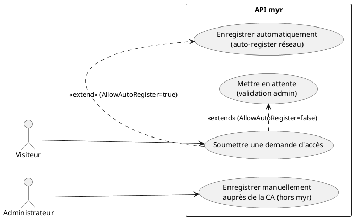
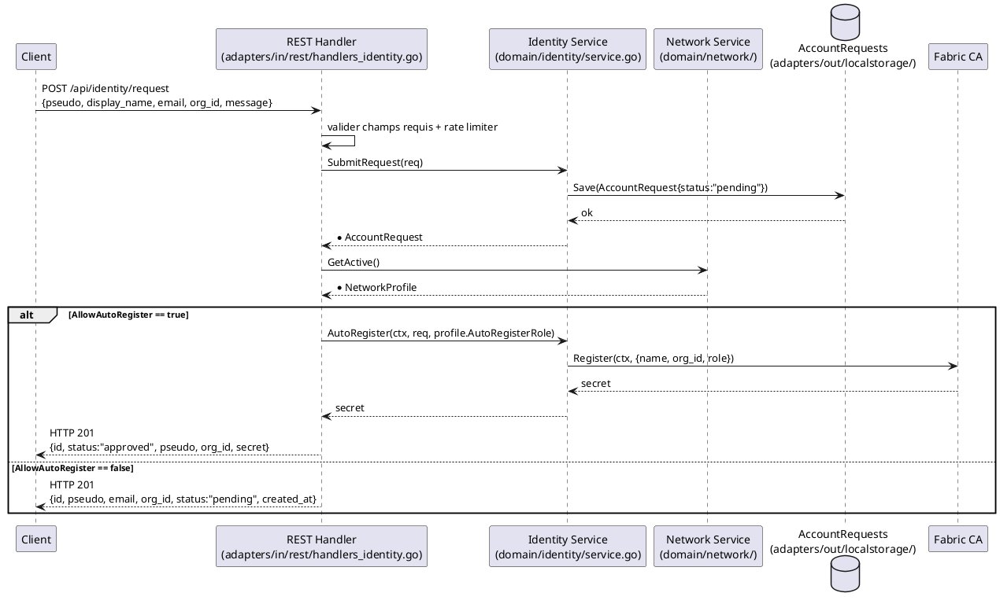

# Création d'un compte

## Diagramme d'acteurs

## Contexte

Il n'existe **pas de compte email + mot de passe** dans `myr`. L'identité d'un utilisateur est une identité cryptographique enregistrée auprès de la Fabric CA du réseau (cf. RM20) : « créer un compte » signifie obtenir un secret d'enrôlement CA valide pour un pseudo donné.

Deux chemins existent pour l'obtenir :

1. **Demande d'accès auto-traitée** : `POST /api/identity/request` — si le réseau actif a `AllowAutoRegister=true`, l'identité est enregistrée immédiatement auprès de la CA (rôle = `AutoRegisterRole` du profil réseau, ou `reader` par défaut — RM21) et le secret d'enrôlement est retourné directement dans la réponse.
2. **Demande d'accès en attente** : si `AllowAutoRegister=false`, la demande est simplement stockée (`AccountRequest`, statut `pending`). **Aucun mécanisme REST ou CLI n'existe aujourd'hui pour qu'un administrateur l'approuve** — seul `GET /api/identity/requests` permet de la consulter. L'administrateur doit créer l'identité manuellement via l'outillage Fabric CA (hors périmètre `myr`) et transmettre le secret à l'utilisateur par un canal hors bande. C'est un écart fonctionnel réel, pas seulement un détail d'implémentation (voir Notes).

Il existe aussi un accès **invité** sans aucune identité CA (voir UCA02, `POST /api/identity/guest`), qui n'entre pas dans ce use case.

## Pré-conditions

- Le serveur `myr` est démarré avec un adaptateur Fabric CA configuré (`ca_endpoint` du réseau actif)
- Un réseau actif est configuré (`networkSvc`) avec un `org_id` valide

## Scénario

### Flux nominal — Auto-enregistrement (`AllowAutoRegister=true`)

1. Le visiteur soumet `POST /api/identity/request` avec `{pseudo, display_name, email, org_id, message}`
2. Le handler valide que `pseudo`, `email` et `org_id` sont renseignés
3. La demande est sauvegardée (`AccountRequest`, statut `pending`)
4. Le profil réseau actif a `AllowAutoRegister=true` : le service appelle `AutoRegister` → enregistrement CA (rôle = `AutoRegisterRole`, ou `reader` si absent — RM21)
5. Le statut de la demande passe à `approved`
6. Réponse `HTTP 201` avec `{id, status:"approved", pseudo, org_id, secret}`
7. Le visiteur conserve ce secret : il lui servira à se connecter (UCA02)

### Flux alternatif — Demande en attente (`AllowAutoRegister=false`)

1. Étapes 1 à 3 identiques
2. Le profil réseau n'autorise pas l'auto-enregistrement (ou aucun réseau actif n'est configuré)
3. Réponse `HTTP 201` avec `{id, pseudo, display_name, email, org_id, message, status:"pending", created_at}`
4. **Écart connu** : aucun endpoint REST ni commande CLI ne permet à l'administrateur d'approuver cette demande et de déclencher l'enregistrement CA correspondant. Seule la consultation (`GET /api/identity/requests`) existe. Le traitement réel se fait aujourd'hui hors `myr` (CA tooling + communication manuelle du secret).

### Flux erreur — Champs requis manquants

1. `pseudo`, `email` ou `org_id` absent du corps JSON
2. Réponse `HTTP 400` avec `{"error": "pseudo, email et org_id sont requis"}`

### Flux erreur — Trop de tentatives

1. Le client dépasse le quota du rate limiter (`authLimiter`) sur cet endpoint
2. Réponse `HTTP 429` avec `{"error": "trop de tentatives, réessayez dans une minute"}`

## Post-conditions

- Une `AccountRequest` existe (statut `pending` ou `approved`)
- Si auto-enregistrement : une identité CA existe (statut `pending` côté CA jusqu'au premier enrôlement effectif via UCA02), avec le rôle défini
- Si en attente : aucune identité CA n'existe encore — le visiteur ne peut pas se connecter tant qu'un administrateur n'a pas agi hors `myr`

## Diagramme de séquence

## Règles métier déclenchées

- **RM20** — Il n'existe pas de compte séparé de l'identité blockchain : la « création de compte » est l'obtention d'un secret d'enrôlement CA.
- **RM21** — Une identité auto-enregistrée reçoit le rôle **Lecteur** par défaut, sauf rôle explicite configuré sur le réseau (`AutoRegisterRole`).

## Exigences non-fonctionnelles

- **ENF12** — La validation du rôle attribué est strictement côté serveur (le rôle est un attribut du certificat CA, jamais choisi par le client).
- Rate limiting appliqué (`authLimiter`) pour prévenir l'énumération/spam de demandes.

## Notes d'implémentation

**Endpoints réels :**
- `POST /api/identity/request` → `handleIdentityRequest` (`adapters/in/rest/handlers_identity.go`)
- `GET /api/identity/requests` → `handleIdentityRequests` (lecture seule, protégée par `requireAuth` — pas de contrôle de rôle admin spécifique constaté)

**Écart — pas de flux d'approbation :** Il n'existe aucun endpoint REST (`POST /api/identity/requests/{id}/approve`) ni commande CLI équivalente pour transformer une `AccountRequest` en pause en identité CA active. C'est un vrai manque fonctionnel, pas une simplification de cette spec — `myr identity` ne propose que `set-role` (UCA08), qui suppose une identité déjà enregistrée.

**Rôle par défaut :** `RegisterRequest.Role` vide → la Fabric CA applique son propre défaut (probablement `reader` au niveau de la configuration CA, pas garanti par le code `myr`) — à vérifier côté configuration CA plutôt que côté application.
