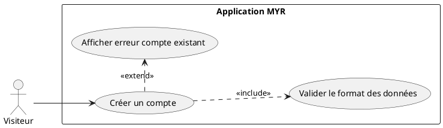
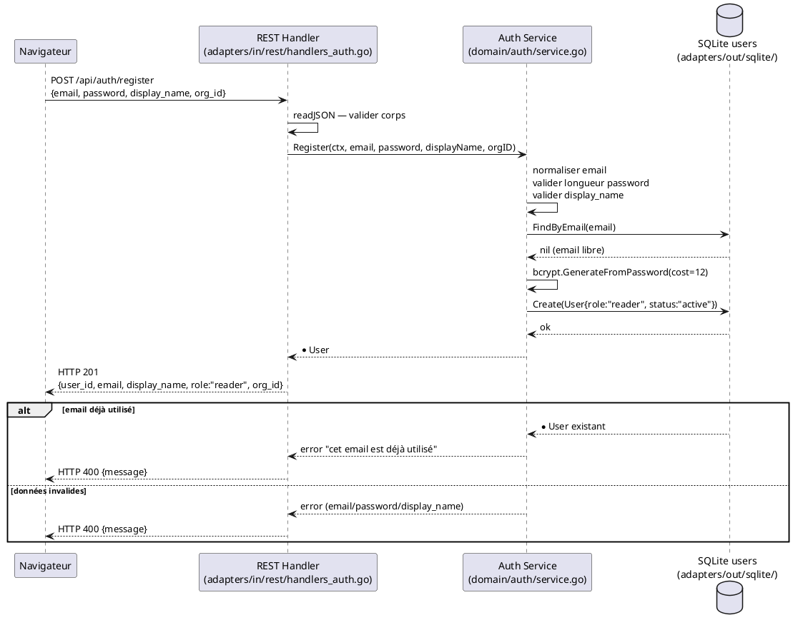

# Création d'un compte

## Diagramme d'acteurs

## Contexte

UCA01 est le point d'entrée obligatoire du système pour tout nouvel utilisateur. Il couvre la couche web (création de compte en base SQLite) mais **pas** la couche blockchain : l'identité Fabric CA (Wallet) est provisionnée à la première connexion (UCA02 — RM20).

Ce découplage est intentionnel : la création du compte est immédiate et ne dépend pas de la disponibilité du réseau Fabric. Si Fabric est temporairement indisponible, le compte est tout de même créé et l'utilisateur peut se connecter dès que Fabric répond.

La variable d'environnement `JWT_SECRET` doit être définie pour que le service auth soit actif. Sans elle, l'endpoint retourne `501 Not Implemented`.

## Pré-conditions

- Le serveur MYR est démarré avec `JWT_SECRET` et `WALLET_ENCRYPT_KEY` configurés
- Un réseau Fabric configuré est accessible (au moins un `org_id` valide est connu)
- L'email fourni n'existe pas déjà dans la table `users` (SQLite)

## Scénario

**Étape initiale :** Le visiteur accède à la page d'inscription et soumet le formulaire

### Flux nominal — Création réussie

1. Le visiteur soumet `POST /api/auth/register` avec `{email, password, display_name, org_id}`
2. Le handler REST valide que le corps JSON est lisible
3. Le service `domain/auth` effectue les validations :
   - Email normalisé (minuscules, trimspace) et contient `@`
   - Mot de passe ≥ 8 caractères
   - `display_name` non vide
   - `org_id` par défaut `"Org1MSP"` si absent
4. Vérification unicité de l'email via `users.FindByEmail`
5. Hash du mot de passe (bcrypt, cost 12)
6. Création de l'enregistrement `User` en base SQLite avec le rôle `reader` (RM21)
7. Réponse `HTTP 201` avec `{user_id, email, display_name, role, org_id}`
8. L'interface affiche : "Compte créé — rôle Lecteur attribué"
9. L'utilisateur peut se connecter immédiatement via UCA02

### Flux erreur — Compte déjà existant

1. `users.FindByEmail` retourne un utilisateur existant
2. Le service retourne `"cet email est déjà utilisé"`
3. Le handler répond `HTTP 400`
4. L'interface affiche le message d'erreur et conserve le formulaire renseigné

### Flux erreur — Données invalides

1. Email manquant, sans `@`, ou mot de passe < 8 caractères
2. Le service retourne le message d'erreur correspondant
3. `HTTP 400` — le formulaire reste accessible

## Post-conditions

- Un enregistrement `User` existe dans la table `users` (SQLite) avec :
  - `status = "active"`
  - `role = "reader"` (RM21)
  - Mot de passe haché bcrypt (jamais en clair)
- Aucun Wallet Fabric CA n'existe encore pour cet utilisateur (RM20)
- L'utilisateur peut immédiatement tenter une connexion (UCA02)

## Diagramme de séquence

## Règles métier déclenchées

- **RM21** — Le rôle **Lecteur** (`reader`) est attribué par défaut à la création du compte. Aucun autre rôle ne peut être assigné lors de cette étape.
- **RM20** — La création du compte ne provisionne **pas** l'identité blockchain (Wallet Fabric CA). Le Wallet est créé à la première connexion (UCA02).

## Exigences non-fonctionnelles

- **ENF27** — Les données personnelles (email, mot de passe haché) sont stockées localement dans SQLite chiffré (`WALLET_ENCRYPT_KEY`).
- **ENF12** — La validation du rôle attribué est strictement côté serveur — jamais côté client.
- **ENF18** — Le domaine `domain/auth/` ne connaît pas SQLite directement : il passe par l'interface `UserStore`.

## Notes d'implémentation

**Écart E3 (VIOLATION RM21) :** `domain/auth/service.go` ligne 93 assigne `Role: "contributor"` au lieu de `"reader"`. Le comportement décrit dans ce UC est le comportement **cible** (specs). Le code doit être corrigé.

**Écart SQLite :** `adapters/out/sqlite/db.go` déclare `role TEXT NOT NULL DEFAULT 'contributor'` dans la migration — cette valeur par défaut doit aussi être corrigée en `'reader'`.

**Statut d'implémentation :**
- Handler `POST /api/auth/register` : **opérationnel** (`adapters/in/rest/handlers_auth.go`)
- Service `Register()` : **opérationnel** sauf écart rôle
- Stockage SQLite : **opérationnel** sauf valeur défaut rôle

**`org_id` :** Si absent dans la requête, le service utilise `"Org1MSP"` par défaut. La liste des organisations disponibles n'est pas validée à ce stade — amélioration future.
