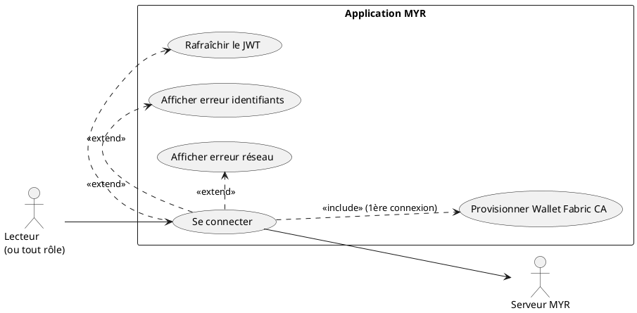
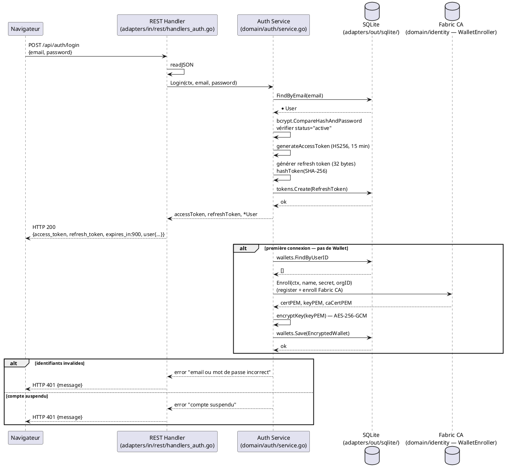

# Se Connecter

## Diagramme d'acteurs

## Contexte

UCA02 est le use case central du domaine Compte & Accès. Il produit le JWT (access token + refresh token) qui conditionne l'accès à toutes les fonctionnalités protégées de l'application.

Il couvre deux cas distincts :
1. **Connexion standard** : l'utilisateur possède déjà un Wallet Fabric CA actif.
2. **Première connexion** : aucun Wallet n'existe — le serveur déclenche le provisionnement via Fabric CA (register + enroll) avant d'émettre le JWT.

Le JWT (access token) a une durée de vie de **15 minutes** (`accessTokenTTL = 15 * time.Minute`). Le refresh token a une durée de vie de **7 jours**. Le client doit utiliser `POST /api/auth/refresh` pour renouveler l'access token sans re-saisir les identifiants.

Le provisionnement Wallet (RM20) est actuellement exposé via un endpoint dédié `POST /api/auth/enroll-wallet` mais **n'est pas déclenché automatiquement** lors du login — c'est un écart par rapport aux specs.

## Pré-conditions

- Le compte utilisateur existe dans la table `users` avec `status = "active"` (voir UCA01)
- `JWT_SECRET` est configuré côté serveur
- Le réseau MYR est accessible (pour le flux de provisionnement Wallet)

## Scénario

**Étape initiale :** L'utilisateur soumet le formulaire de connexion

### Flux nominal — Connexion standard (Wallet existant)

1. L'utilisateur soumet `POST /api/auth/login` avec `{email, password}`
2. Le handler REST valide le corps JSON
3. `domain/auth.Login()` normalise l'email et appelle `users.FindByEmail`
4. Vérification `bcrypt.CompareHashAndPassword`
5. Vérification `u.Status == "active"`
6. Génération de l'access token JWT (HS256, TTL 15 min, claims : `sub`, `email`, `role`, `org`, `name`)
7. Génération d'un refresh token (32 bytes aléatoires, hash SHA-256 stocké dans `refresh_tokens`)
8. Réponse `HTTP 200` avec `{access_token, refresh_token, expires_in:900, token_type:"Bearer", user{…}}`
9. Le client stocke les tokens et redirige vers le tableau de bord

### Flux nominal — Première connexion (provisionnement Wallet)

1. Étapes 1 à 5 identiques au flux standard
2. Le serveur vérifie l'absence de Wallet actif via `wallets.FindByUserID`
3. Appel `EnrollWallet` : register + enroll auprès de Fabric CA, chiffrement AES-256-GCM de la clé privée, stockage dans la table `wallets`
4. Réponse `HTTP 200` avec les mêmes tokens — le Wallet est transparent pour l'utilisateur

### Flux alternatif — Rafraîchissement du JWT

1. L'access token est expiré (TTL 15 min dépassé)
2. Le client soumet `POST /api/auth/refresh` avec `{refresh_token}`
3. Le service vérifie le hash du refresh token en base et sa date d'expiration
4. Un nouvel access token est généré et retourné `HTTP 200 {access_token, expires_in:900}`
5. Le refresh token reste valide jusqu'à son expiration (7 jours) ou déconnexion

### Flux erreur — Identifiants invalides

1. `bcrypt.CompareHashAndPassword` échoue, ou email introuvable
2. Le service retourne un message générique (non différencié pour éviter l'énumération)
3. `HTTP 401` avec `{"message": "email ou mot de passe incorrect"}`
4. Le formulaire reste accessible pour une nouvelle tentative

### Flux erreur — Compte suspendu

1. `u.Status != "active"`
2. `HTTP 401` avec `{"message": "compte suspendu"}`

### Flux erreur — Serveur inaccessible

1. La requête échoue (timeout ou erreur réseau)
2. L'interface affiche : "Impossible de contacter le serveur, veuillez réessayer"

## Post-conditions

- L'utilisateur dispose d'un access token JWT valide (15 min) et d'un refresh token (7 jours)
- Si première connexion : un Wallet Fabric CA actif existe dans la table `wallets` (RM20)
- La session est active — les requêtes suivantes portent l'en-tête `Authorization: Bearer <access_token>`
- L'accès aux fonctionnalités est accordé selon le rôle encodé dans le JWT

## Diagramme de séquence

## Règles métier déclenchées

- **RM20** — Le Wallet Fabric CA (certificat X.509) est provisionné à la **première connexion**, pas à la création du compte. Cette vérification est à implémenter dans `Login()`.
- **RM21** — Le rôle encodé dans le JWT est celui stocké en base — si le compte a bien été créé avec `reader`, le JWT contiendra `role: "reader"`.
- **RM22** — L'accès aux fonctionnalités est conditionné par le rôle encodé dans le JWT, vérifié par le middleware `withJWTAuth` et les contrôles de rôle dans les handlers.

## Exigences non-fonctionnelles

- **ENF01** — Le login doit répondre en < 500 ms (hors provisionnement Wallet).
- **ENF22** — Compatible Chrome 120+, Firefox 120+, Safari 17+, Edge 120+.
- **ENF27** — Les tokens de refresh sont stockés hashés (SHA-256) — jamais en clair.
- **ENF12** — La validation JWT est strictement côté serveur.

## Notes d'implémentation

**Wallet non déclenché automatiquement au login (VIOLATION RM20) :**
Le service `Login()` (`domain/auth/service.go`) ne vérifie pas l'existence d'un Wallet et ne déclenche pas `EnrollWallet`. L'endpoint `POST /api/auth/enroll-wallet` existe mais est déclenché manuellement. L'implémentation cible doit ajouter dans `Login()` : `if wallets.FindByUserID(u.ID) == nil { EnrollWallet(...) }`.

**Refresh token :** Le handler `POST /api/auth/refresh` est implémenté (`handleAuthRefresh`) mais n'apparaît pas dans UCA Expression — il est documenté ici comme flux alternatif.

**Statut d'implémentation :**
- `POST /api/auth/login` : **opérationnel** — retourne JWT + refresh token
- `POST /api/auth/refresh` : **opérationnel**
- Provisionnement Wallet au login : **non implémenté** (écart RM20)
- Vérification Wallet existant dans Login : **absente**

**Durée des tokens :** `accessTokenTTL = 15 * time.Minute`, `refreshTokenTTL = 7 * 24 * time.Hour` — constantes dans `domain/auth/service.go`.
